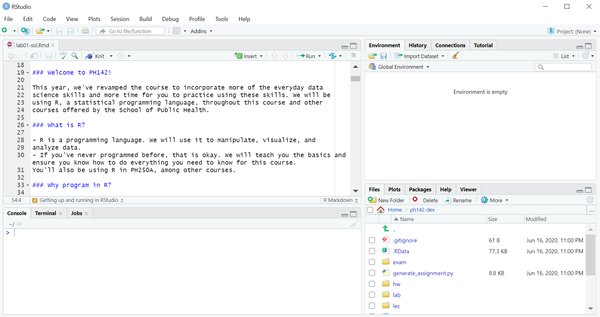
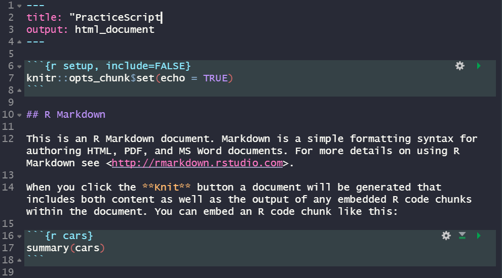

```{r setup, include = FALSE}
knitr::opts_chunk$set(echo = TRUE)
library(testthat)
```

### Instructions 
* Due date: Monday, January 24th, 10:00pm PT with 2 hour grace period.
* Late penalty: 50% late penalty if submitted within 24 hours of due date, no marks for assignments submitted thereafter.
* This assignment is graded on **correct completion**, all or nothing. You must pass all public tests and submit the assignment for credit.
* Submission process: Follow the submission instructions on the final page. Make sure you do not remove any `\newpage` tags or rename this file, as this will break the submission.


### Welcome to PHW142!

This year, we've revamped the course to incorporate more of the everyday data science skills and more time for you to practice using these skills. We will be using R, a statistical programming language, throughout this course and other 
courses offered by the School of Public Health. 

### What is R?

- R is a programming language. We will use it to manipulate, visualize, and analyze data. 
- If you've never programmed before, that is okay. We will teach you the basics and ensure you know how to do everything you need to know for this course. You'll also be using R in PH250A, among other courses.

### Why program in R?

- Because it is programming, you can easily save all your steps 
    - Easy to re-run/duplicate.
    - Easy to extend.
    
- R is free and open source. This means that anyone can install and use it, 
making it more accessible than SAS and Stata.

- R is flexible and ever-evolving. 

### What is RStudio?

RStudio is an integrated development environment (IDE). RStudio makes it easier to program in R. Without RStudio, all we would see when we open R is a console where we enter our lines of code.

### Getting up and running in RStudio

By default, RStudio displays four panes shown below:

```{r, echo=F, out.width="400px"}

```

Today, you will complete the exercises below to become familiar with the four panes.

**Pane 1. Console (bottom left pane)** This is where you input code to be processed. 
Numeric output will display in the console.

In the console you will notice a **>** at the beginning of a line. This is a prompt - it is R's way of saying that it is your turn to say something. When you type something and press enter, R will evaluate what you have "said" and respond. If you type a number and hit enter, R will return that number. You can also type an equation or use R like a calculator.

- **Exercise 1:** Practice using the console like a calculator. Click inside the console, type `2+2` and hit enter. Make sure you can add (+), subtract (-), multiply (*), divide (/), and take powers (^). Use round brackets for PEMDAS.
- **Exercise 2:** Type `tinytex::install_tinytex()` in the console and press enter. This loads a package that will help you knit files more quickly!
- **Exercise 3:** Suppose you were interested in calculating how much you'd earn in a month at a new job. The job pays $20 per hour and you will work 15 hours per week, but are taxed at 20%. How much money after tax will you have at the end of one month? Using the console like a calculator, calculate your answer.

**Creating an object**
If you would like to save something (a number, a vector, a dataset etc.) for use later, you can save it as an object. You can think of this like creating a jar and giving it a label.  

For example, type the code `a <- 2` into the console. This stores the value `2` in the object `a`. You can also type `a <- 1 + 1`, and this does the same thing, since the evaluation of the right-hand side happens before it is assigned to the variable.  Notice that when you create an object, R does not respond, but if you then type the object name, R will respond with the contents of the object.  

**Code chunks**
We will often provide code chunks in the R markdown files: these are little sections of code set off from the text of the file with ```{r} at the beginning and ``` at the end. In Rstudio you can see that the code chunks appear in a gray background. You should also notice the green arrows in the upper right hand side of each chunk. If you click the arrow pointing to the right, R will submit everything in the "chunk" and you will see the results just below the chunk.

- **Exercise 4:** In the code chunk below, use the assignment operator (`<-`) to store your answer in an object called `monthly_wage`. When assigning variables, the stuff on the right-hand side of the arrow `<-` is evaluated first, and then assigned to the object specified by the variable name on the left of the arrow.

```{r monthly-wage}
monthly_wage <- "YOUR CODE HERE"
```

You can also save a series of numbers in an object.  For example: `heights <- c(5,6,2,9,6)` will save a set of values in the object "heights". The `c()` tells R to "combine" the numbers into a list, known in R as a **vector**.

**Pane 2. Environment/History/Connections:** What is in the environment tab right now? It is letting you know about the **objects** that we saved in the **Environment**. When we load in a data set, we will also be able to see its object here too. For datasets, there is an icon we can push to view all the data. Now click the History tab. What is it? Click a line of code and hit the "To Console" or "To Source" buttons. What happens? The History tab is a great way to recall a line of code that you may have typed directly in the console but hadn't saved in the code editor and would like to use again. We will ignore the connections tab.

If you ran the code chunk above, you should see `monthly_wage` as an object in the Environment window.  

**Types of variables in R**
Notice in the Environment tab that you can see a description of each object that has been saved.  
For datasets, you will see the number of observations and variables. For variables you will see the type of variable. 

In R, continuous variables will be called numeric or "NUM".

Categorical variables may be recorded as text or as numbers (category 1, 2, 3 etc.).

Text variables will be called character or "chr".

**Functions**
A function is an instruction or a set of instructions in R.
For example sqrt() is a function built in to R.  This will take the square root of a number.
Type `sqrt(81)` into your command window.
In this example:
  -**sqrt** is the name of the function: taking the square root
  -**the parentheses** creates a space where we put the number we want to use the function on
  -**81** the number we are placing in our function
There are many functions built in to R. For example:
abs() takes the absolute value 
log() takes the natural log
exp() gives powers of e
ls() will give you a list of all of the objects in your environment


### Help! 

Each function comes with a help page telling you what it does and what arguments you need to provide the function. There are two ways to see the help page of a function:

```{r help-when-you-know-function-name, eval = F}
help("library")
?library
```

When we execute either of the above lines of code, the Help tab will open and navigate to the help page for the function `library()`. Calling a help page in this way is most useful if you know the name of the function you'd like to use but forget exactly how to use the function. Don't worry if you can't understand what is written there right now. 

If you would like help, but can't remember then name of the function you need help with, you can type a double question mark before a word that is related to the function you are looking for:
```{r help-on-a-general-topic, eval = F}
??histogram
```

This shows you all the packages and their functions which discuss histograms. For example `ggplot2::geom_freqpoly` means that there is a function `geom_freqpoly()` from the `ggplot2` package that is used to make histograms. You can click through the functions until you find the one you're looking for.

**Pane 3. Source (top left pane)** a.k.a the code editor a.k.a the script editor. While the **console** is meant to be used interactively, the **source** is a place to store multiple lines of code to develop into a full-fledged analysis. You can use keyboard shortcuts and icons to send your code from the source to the console. You can save this "code book" and open it later. You can also open someone else's code in this window. Each week we will provide a lab file (like this one) called an R Markdown file. This type of file allows you to save text and code together. When this type of file is "knit" it will also show the results of any code chunks.  

- **Exercise 5:** Create your first script. Click File > New File > R Markdown. Name the file "PracticeScript". A new file will open with an **R Markdown** template. Notice that the "title" shown on line 2 is what you named your file. **R Markdown** lets you weave together plain text (sentences for human consumption) and code (sentences for computer consumption). The code is embedded in **R code chunks** beginning and ending with a set of three back ticks (```). The beginning set of ticks also includes an "r" to denote that we are providing R code and an optional title that is used to describe the contents of the code chunk. After the comma we can include optional **chunk options** that we will discuss later. The image below shows the first 19 lines of code from the default-generated R Markdown file:

```{r code-chunk-description, echo = F, out.width="400px"}

```

- **Exercise 6:** Read the text in the practice script you created. Click the button labeled **Knit**. Save the file name as "PracticeScript". Compare the file that is generated when you hit "Knit" (it should open in a pop-up window) with the script shown in the code editor. 
    - See Figure 2.1 on this website: http://socviz.co/gettingstarted.html. From Figure 2.1, notice what is typed in markdown vs. what the output looks like.
- **Exercise 7:** Delete lines 8 through 30 of the practice script markdown file. This should leave only the header information (the top four lines including the "---" at the top and bottom). Knit your file and see what appears in the Viewer window. 
- **Exercise 8:** Update the title of your file (line 2) to "Report on wages" by typing into the source. Then, starting on line 8 write: "To calculate my monthly wage, I multiplied the hourly rate by the number of hours worked and multiplied this product by the number of weeks in a month. Finally, I multiplied by 80% to account for taxes." Then knit your file again.
- **Exercise 9:** Add a code chunk to the file at line 12. To do this, click the place in the template you'd like to add your chunk, and then click the **Insert** button and choose R from the dropdown menu. The keyboard shortcut for this is `option + cmd + i` on Mac OS and `Ctrl + Alt + i` on PC. 
- **Exercise 10:** Write the code `monthly_wage <- 20 * 15 * 4 * 0.8` inside the code chunk. Name the code chunk "calculate-wage" (see the image above to remind yourself how to name the code chunk). 
- **Exercise 11:** On the next line (inside the code chunk) write `monthly_wage`. When we execute this line, we are asking R to display the value that we assigned to the variable `monthly_wage`. Execute the code chunk by pressing its green arrow or placing your cursor on the line of code and hitting `cmd + enter` on Mac or `Ctrl + enter` on PC.

\setlength{\leftskip}{0pt}

**Pane 4. Files/Plots/Packages/Help/Viewer** These tabs are all useful! The file tab is a basic file viewer. What files are in your folder? The Plots tab displays any plots you've created using code executed in the console. The packages tab shows you the R packages installed (as a list) and those loaded are checked off. We will talk more about R packages in the next lab. The Help tab is used to search the help files. The Viewer tab is used to view other types of output (often html output), like the file we created when we knit the R markdown file.
    
### What is an R package?

- An R package is a set of **functions** that someone has put together. For example, the package `ggplot2` is a set of functions to make plots, the package `dplyr` is a set of functions to manipulate datasets, such as functions to rename and create new variables.
- When you load R, a basic set of packages are loaded. R developers have created more than 10,000 additional packages that you can download from **CRAN** (The Comprehensive R Archive Network), the main repository of R packages.

On Datahub, we have already installed the package `dplyr` and `ggplot2` to use during the course. We just need to load the packages using the `library()` function:

```{r load-library-example, eval = F}
library(dplyr)
library(ggplot2)
```

You can identify a function because it will always end with a set of round brackets `()`. Another name for **function** is **command**. `library(dplyr)` is a **function** call with one argument, `dplyr`. The **argument** of the **function** is inside the round brackets. Many functions take multiple arguments. Here, we are using the `library()` function to load the `dplyr` package on the first line and the `ggplot2` package on the second line.

### What happens when you load a package? 

Click the packages tab and scroll down to the package name that you loaded. It should now be checked to indicate that it is loaded. Sometime when you load a package, a message will display. You don't need to worry about understanding these messages for now, but here is a description if you're interested (don't worry if you don't understand, it isn't important right now and will make more sense as you learn R):
- Red output (called messages) tell you that the package is being attached (i.e., loaded). It also lists objects that are **masked** from other packages. This means that R already had loaded packages called `stats` and `base` and they have functions with the same names as functions in the`dplyr` package. Now that we loaded `dplyr`, its functions take precedence. If we want to use the `filter()` function from the `stats` package we have to write `stats::filter()`, where the package name preceding the double colons tells you which version of the function you want to use.

### Using the autograder
Problem set and lab questions are evaluated using an autograder. We've written a series of test cases and checkpoints that test the correctness of your code and allows you to check your work and receive automated real-time feedback on your answers. 

Now let's try solving a problem. In your assignments, you will be given a prompt and asked to code the answer and assign it to an object. Do not change the name of this object. **For this problem, set `p1` to a mathematical expression that evaluates to 5.** You'll often get starter code that will look like this:

```{r five, eval = FALSE}
# Your answer must be stored in the object p1
p1 <- NULL # YOUR CODE HERE
```

As you work on the problem, replace the text `NULL # YOUR CODE HERE` with your solution to the problem. Running `. = ottr::check("tests/p1.R")` will then tell you if you're right or wrong, and sometimes provide helpful hints. Let's try.

```{r}
p1 <- NULL # YOUR CODE HERE
```

```{r}
. = ottr::check("tests/p1.R")
```


When you enter the correct answer, `. = ottr::check("tests/p1.R")` should tell you all checkpoints passed, and all tests pass for that problem. Now... what if we don't know how to follow directions? Let's see what happens when you enter in a wrong answer. Run the following two chunks in order and observe their output.

```{r five-wrong}
# This is a WRONG NUMERIC answer. 
p2 <- 100 + 42
```

```{r}
. = ottr::check("tests/p2.R")
```
```{r five-wrong-again}
# This is a REALLY WRONG answer. 
p3 <- "Stanfurd"

```

```{r}
. = ottr::check("tests/p3.R")
```


You'll also run into problems that will ask you to explain your answer in a couple of sentences, like the problem below. Simply replace the line `_Type your answer here, replacing this text._` with your answer. You won't see an autograder check for these free-response questions since they'll be graded by humans.

**Problem 4: What are you looking forward to most in this course?**

I am looking forward to...


Now, at the end of the assignment, you should go back through and run each code chunk to be sure you passed all of your tests. On this assignment, that only means that `p1`, `p2`, and `p3` should all equal 5. One way to check that works well is to click the grey downward facing arrow in the right corner of the code chunk. This will run all previous code chunks so all of your answers are up to date.

When you're happy with your work, you can submit your assignment--without even leaving RStudio! The submission instructions will be on the last page of every assignment, including this one. Make sure you don't forget to submit.

Run these next cells to correct all of your answers.
```{r correct-p1}
p1 <- 5
```

```{r correct-p2}
p2 <- 5
```

```{r correct-p3}
p3 <- 5
```

### A Note About the Autograder

The autograder is meant to be used as a sanity check for your work, not as an absolute check of correctness. This is because, in the real world, you won't have an autograder to check your analysis/code... unless you write your own test cases (which is recommended, but we won't be covering that in this course). However, **programming is difficult**, and we want to provide you with the best resources to succeed so we will write all the test cases in labs. Since the problem sets are not being collected for credit, we will also write all the test cases for these. Our goal is that you won't rely too much on the autograder for the problem sets - you can try out a few things and try to intuitively solve the problems. Ask lots of questions - we're excited for you to start the journey of being a data analyst.

Since **labs** have an emphasis on introductory learning, all test cases will be provided. This means if you pass the test cases given in the assignment, you'll receive full credit on the assignment. Because of this design, each test case will be graded **all or nothing,** which means we will not grant credit for partially correct answers.

### Checking Your Grades & Regrades

When your assignment is graded, it'll be released on Gradescope and you'll be able to see your code online, as well as the score for each autograded problem and each free-response question. 

We know we're not perfect, and sometimes we mess up the test cases on the autograder, so a correct answer might get graded as incorrect (we hope this is rare), so we highly encourage you to check your assignment promptly after grades are released to make sure you get the score you earned. If you suspect that the autograder might be incorrect, you can submit a regrade on Gradescope. Per the regrade policy, **all assignment regrades will be open for 3 school days after scores are released** (scores released anytime Jan 1 means regrades close Jan 4 at 11:59pm).


### Resources
We will do our best to introduce and demonstrate all of the code you will need for this class. If you would like to study more on your own, there are many many resources available online. If you have questions about R or get stuck, please visit office hours or post on Piazza.

Hadley Wickham and Garrett Grolemund have written a helpful book about R that is freely available here:  https://r4ds.had.co.nz/

UCLA has a website with many helpful examples here:  https://stats.idre.ucla.edu/r/

Finally, Google is your best friend. We will show you how to use Google to ask questions about R. Generally speaking, many answers to your questions will live on a website called Stack Overflow. 

\newpage

### References

These are the materials I referenced to make these slides. You can look at them but note that I avoided the material that isn't relevant to us (and might be confusing for newly-minted learners) 

- https://www.computerworld.com/article/2884322/application-development/learn-r-programming-basics-with-our-pdf.html

- http://alyssafrazee.com/2014/01/02/introducing-R.html

\newpage

### Before you submit

You need to create a password for your Gradescope account: 

1. Go to https://www.gradescope.com/login
2. Click "School Credentials" in the bottom left
3. Click "CalNet ID" 
4. Enter your CalNet ID credentials to log in
5. Click on "Account" in bottom left select "Edit Account" 
6. Create a password and select "Save Changes" 

**It is important to select "Save Changes" so your new password stays saved.**

### Submission

For assignments in this class, you'll be submitting using the **Terminal** tab in the pane below. In order for the submission to work properly, make sure that:

1. Any image files you add that are needed to knit the file are in the `src` folder and file paths are specified accordingly. 
2. You **have not changed the file name** of the assignment.
3. The file knits properly.

Once you have checked these items, you can proceed to submit your assignment.

1. Click on the **Terminal** tab in the pane below.
2. Copy-paste the following line of code into the terminal and press enter.

cd; cd phw142-sp22/lab/lab01; python3 turn_in.py

3. Follow the prompts to enter your Gradescope username and password.
4. If the submission is successful, you should see "Submission successful!" appear as the output. **Check your submission on the Gradescope website to ensure that the autograder worked properly and you received credit for your correct answers. If you think the autograder is incorrectly grading your work, please post on piazza!**
5. If the submission fails, try to diagnose the issue using the error messages--if you have problems, post on Piazza under the post "Datahub Issues".

The late policy will be strictly enforced, **no matter the reason**, including submission issues, so be sure to submit early enough to have time to diagnose issues if problems arise.

