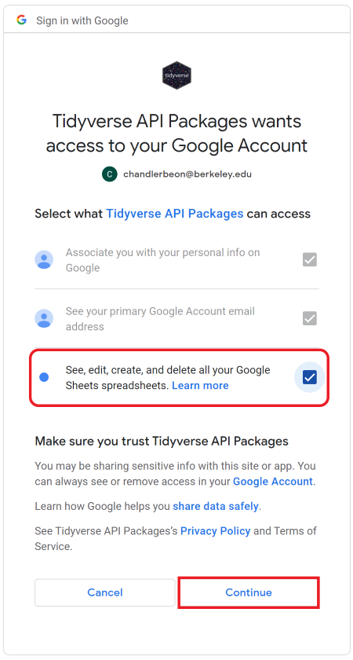

Refer to the information below if you are receiving the following error:

`Error: Client error: (403) PERMISSION_DENIED * Client does not have sufficient permission. This can happen because the OAuth token does not have the right scopes, the client doesn't have permission, or the API has not been enabled for the client project. * The caller does not have permission Run `rlang::last_error()` to see where the error occurred.`

------

Since we are extracting data from Google Sheets, we need to give Tidyverse (the library) permission to use your Google account to fetch the data.

Step 1: Run the chunk below. It should take you to a new window in your browser.

Note - if it recognizes your email from before and asks you for your selection, type '0' into the Console and press enter.

```{r deauth-auth}
library(googlesheets4)

gs4_deauth()
gs4_auth(scopes = 'https://www.googleapis.com/auth/spreadsheets', path = Sys.getenv('GOOGLE_DRIVE_KEY'))
```

Step 2: Select your berkeley.edu email to continue with the authentication

Step 3: Click on the third box that says "See, edit, create, and delete all yourGoogle Sheets spreadsheets." _Checking this box will actually give Tidyverse/GoogleSheets4 permission to read data -- please double check that the box is checked_.

Click on continue to move forward with the authentication process.

```{r, out.width = "50px", out.extra='style="background-color: #9ecff7; padding:10px; display: inline-block;"'}
library(knitr)

```

Step 4: Copy the authorization code provided by Google and paste it in your Rstudios **Console** (there should be a new line in the console that says 'Enter authorization code:"`)

Step 5: Once you enter, you should be able to run the following chunks from Lab 8 and read the google sheet into the variable `our_sheet`:

```{r select-key}
#Note: Remember to remove `#Lab1XXB: ` before running the chunk!

#Lab101B: my_key <- "10VAX5LuKjzLLW-pUSO6C9IlHxmU55uIAFenqvj_phCk"
#Lab102B: my_key <- "1DNuJdbm9dP6XjFIfHQ_wSSBK9XWNzD2XKJeIXtcx1jQ"
#Lab103B: my_key <- "1Gg1-YXZX89CJvGGAKUym0GHOG2VDIlwqrX-p3k9YYPQ"
#Lab104B: my_key <- "1K-83UnarAdOWXETV9fxu5xmfKbOGupNREEEjPwFSY3A"
#Lab105B: my_key <- "16sgiQcBU9YTTyY08WeFKgozqa_bUJV19DNqvyYfkNVU"
#Lab106B: my_key <- "1Ru_oZozCRTpMOhuWrr48k-y2BjckUjmYaIbce7Tmfhk"
#Lab107B: my_key <- "1DkmXln-OoPwXmFv0NvFzQPR1eYAm7Rf1HIprjQ6AjD0"
#Lab108B: my_key <- "1J31SlmRPnsjOQ1UrgHLQ8RDl_z7KEv4xXbrP4nwyuIY"
#Lab109B: my_key <- "1vNyTDTrExD6cDZuKQYDY0rXe-0oWaBBV6c48Anp5LyA"
#Lab110B: my_key <- "1f04hHZA7Vn36Xu62iWStBPnX6oSAAE7LGOStN9rwjmA"
#sample: my_key <- "1v9Mvm2hAOB3orINrcbVldJaH1UHcsotynn91Ppyi7OY"

```

```{r}
our_sheet <- my_key %>%
  read_sheet()
# This creates a dataframe called our_sheet from the data we entered in our googlesheet.
``` 
