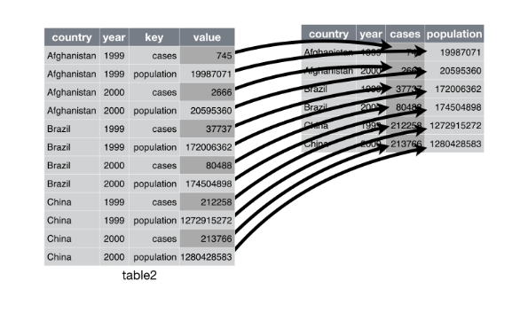

**Run this chunk of code to load the autograder package!**
```{r setup, include = FALSE}
knitr::opts_chunk$set(echo = TRUE)
library(testthat)
```

### Instructions 
* Due date: Monday, April 4th, at 11:59PM PST.
* Late penalty: 50% late penalty if submitted within 24 hours of due date, no marks for assignments submitted thereafter.
* This assignment is graded on **correct completion**, all or nothing. You must pass all public tests and submit the assignment for credit.
* Submission process: Follow the submission instructions on the final page. Make sure you do not remove any `\newpage` tags or rename this file, as this will break the submission.

### Introduction

Part 1 of this lab focuses on two datasets sampled from data collected early in the HIV epidemic. Part 2 focuses on conducting a t-test, and compares results from a paired test vs. an independent test.

### Section I: HIV data

- We have two data sets, both sampled from data collected relatively early in the HIV epidemic. 
- Deeks, et al. (1999) performed a longitudinal study of HIV-infected adults undergoing Highly Active Anti-Retroviral Therapy (HAART) at San Francisco General Hospital (SFGH). 
- Patients were included in this analysis if they received at least 16 weeks of continuous therapy with an anti-retroviral regimen.
- For both data, the outcome is a measure of severity of the disease, a count of an immune cell type called CD4.

### More on data

- The first dataset, `deeks_ex1.csv`, has one response measurement per subject, which is their average CD4 count.  
- The data set also contains a single binary covariate `age` (1 if $\ge40 years$, 0 if $\le 40$).
- The second dataset, `deeks_ex2.csv`, has two measurements per individual, one at
each level of the binary viral load (`vl` = 1 if $\ge$ 2000, `vl` = 0 if $\le$ 2000).

### Age versus CD4 count

**1. After importing `deeks_ex1.csv` into R, visually compare the distribution of CD4 counts between individuals where `age = 1` vs. `age = 0`. Note that these datasets are located in the data folder.**

```{r ans1, message = F, warning = F}
library(ggplot2)
library(readr)
library(dplyr)
library(tidyr)
library(tidyverse)
library(testthat)
```

```{r}
deeks1 <- 'LOAD DATA HERE'
p1 <- 'YOUR GGPLOT CODE HERE'
p1

```


**2. [1 point] Which testing procedure can be used to test the difference between the mean CD4 counts across individuals with `age = 1` vs. `age = 0`? Perform the test using an R function. Note the estimated mean difference and the provided 95% confidence interval. Assign your p-value rounded to 2 decimal places to the object `pvalue_deeks`.**

(If you have extra time, confirm that you can calculate the test statistic using dplyr functions only).

```{r ans2}
# YOUR T-TEST CODE HERE

pvalue_deeks <- 'REPLACE WITH P-VALUE ROUNDED TO 2 DECIMAL PLACES'

```

```{r}
. = ottr::check("tests/p2.R")
```
_Type your answer here, replacing this text._

### CD4 count and viral load

**3. [1 point] Read in the `deeks_ex2.csv` dataset and assign it to an object called `deeks2`. The data is in "long" format (with two rows per individual, one for each level of `medvl`). Use the `pivot_wider()` function from `tidyr` to convert the data into "wide" format so the CD4 measures at `medvl = 0` and `medvl = 1` are contained in the same row for each individual and assign this new dataset to an object called `deeks_wide`. Try using the help window to figure out how to use this function!**

Here is an illustration of how spread works:
```{r}

```

```{r}
deeks2 <- NULL # YOUR CODE HERE
deeks2

deeks_wide <- NULL # YOUR CODE HERE
deeks_wide

# YOUR CODE HERE
```

```{r}
. = ottr::check("tests/p3.R")
```

**4. [1 point] Rename the `medvl` = 0 and `medvl` = 1 columns as "high" and "low", respectively. Then calculate the difference in CD4 counts (high - low) for each individual and save this value in a new column `diff`.**

```{r}
deeks_wide <- NULL # YOUR CODE HERE
deeks_wide


# YOUR CODE HERE
```

```{r}
. = ottr::check("tests/p4.R")
```

**5. [1 point] Visualize the distribution of the *individual differences* in CD4 counts in `deeks_wide` and add an x-intercept line at the mean value of the `diff` variable.**

```{r}
p5 <- NULL # YOUR CODE HERE
p5


# YOUR CODE HERE
```

```{r}
. = ottr::check("tests/p5.R")
```


**6. [1 point] Which of the testing procedures that we've learned so far can be used to test the difference between each individual's CD4 count during a time of high vs. low viral load? Perform the test using an R function. Note the estimated mean difference and the provided 95% confidence interval. Report your p-value rounded to 4 decimal places.**

```{r}
p6 <- NULL # YOUR CODE HERE
p6


# YOUR CODE HERE
```

```{r}
. = ottr::check("tests/p6.R")
```
_Type your answer here, replacing this text._

\newpage

### Section II: Coin Flip Game.

*If you are doing this lab before your lab section, please answer the questions using the sample Googlesheet*.

Go to this [website](https://faculty.washington.edu/chudler/java/rldot.html)

The game: See how many dots you can hit in the grid within 30 seconds. We will each try this once with our dominant hand and once with our non-dominant hand (**where your dominant hand is the one you prefer to operate a computer mouse or track pad with**).

Instructions:

Flip a coin to see which hand to play the game with first:
    - Heads = dominant hand first
    - Tails = non-dominant hand first

*Don't have a coin near you? That's okay! How do you simulate flipping a coin in R?*

**7. Play the game and record the number of dots you hit in the google sheet corresponding to your lab section number:**

# Lab 101B (Noel): https://docs.google.com/spreadsheets/d/10VAX5LuKjzLLW-pUSO6C9IlHxmU55uIAFenqvj_phCk/edit#gid=0
# Lab 102B (Jane): https://docs.google.com/spreadsheets/d/1DNuJdbm9dP6XjFIfHQ_wSSBK9XWNzD2XKJeIXtcx1jQ/edit#gid=0
# Lab 103B (Brian): https://docs.google.com/spreadsheets/d/1Gg1-YXZX89CJvGGAKUym0GHOG2VDIlwqrX-p3k9YYPQ/edit#gid=0
# Lab 104B (Chandler): https://docs.google.com/spreadsheets/d/1K-83UnarAdOWXETV9fxu5xmfKbOGupNREEEjPwFSY3A/edit#gid=0
# Lab 105B (Nolan): https://docs.google.com/spreadsheets/d/16sgiQcBU9YTTyY08WeFKgozqa_bUJV19DNqvyYfkNVU/edit#gid=0
# Lab 106B (Kelsey): https://docs.google.com/spreadsheets/d/1Ru_oZozCRTpMOhuWrr48k-y2BjckUjmYaIbce7Tmfhk/edit#gid=0
# Lab 107B (Noel): https://docs.google.com/spreadsheets/d/1DkmXln-OoPwXmFv0NvFzQPR1eYAm7Rf1HIprjQ6AjD0/edit#gid=0
# Lab 108B (Siavash): https://docs.google.com/spreadsheets/d/1J31SlmRPnsjOQ1UrgHLQ8RDl_z7KEv4xXbrP4nwyuIY/edit#gid=0
# Lab 109B (Ant): https://docs.google.com/spreadsheets/d/1vNyTDTrExD6cDZuKQYDY0rXe-0oWaBBV6c48Anp5LyA/edit#gid=0
# Lab 110B (Brian): https://docs.google.com/spreadsheets/d/1f04hHZA7Vn36Xu62iWStBPnX6oSAAE7LGOStN9rwjmA/edit#gid=0

# sample: https://docs.google.com/spreadsheets/d/1v9Mvm2hAOB3orINrcbVldJaH1UHcsotynn91Ppyi7OY/edit?usp=sharing

**8. Re-do the game, this time with the other hand. Record the results in the google sheet.**

**9. Now we need to read the data from the googlesheet into R.** 

**To read the data from the googlesheet into R, navigate to the lab08-auth-help.Rmd file in the lab08 folder in datahub. Follow the outlined steps to load the data. If you cannot get the google authorization to work, you may download the google sheet and load the data manually.**

```{r read-into-r}
library(googlesheets4)
```

Hit "enter" after your lab. For example, if I am in Lab101B, I would hit "enter" after `Lab101B:` so the variable `my_key` is on its own line and takes the value of the long string of letters and numbers.

```{r select-key}

#Lab101B: my_key <- "10VAX5LuKjzLLW-pUSO6C9IlHxmU55uIAFenqvj_phCk"
#Lab102B: my_key <- "1DNuJdbm9dP6XjFIfHQ_wSSBK9XWNzD2XKJeIXtcx1jQ"
#Lab103B: my_key <- "1Gg1-YXZX89CJvGGAKUym0GHOG2VDIlwqrX-p3k9YYPQ"
#Lab104B: my_key <- "1K-83UnarAdOWXETV9fxu5xmfKbOGupNREEEjPwFSY3A"
#Lab105B: my_key <- "16sgiQcBU9YTTyY08WeFKgozqa_bUJV19DNqvyYfkNVU"
#Lab106B: my_key <- "1Ru_oZozCRTpMOhuWrr48k-y2BjckUjmYaIbce7Tmfhk"
#Lab107B: my_key <- "1DkmXln-OoPwXmFv0NvFzQPR1eYAm7Rf1HIprjQ6AjD0"
#Lab108B: my_key <- "1J31SlmRPnsjOQ1UrgHLQ8RDl_z7KEv4xXbrP4nwyuIY"
#Lab109B: my_key <- "1vNyTDTrExD6cDZuKQYDY0rXe-0oWaBBV6c48Anp5LyA"
#Lab110B: my_key <- "1f04hHZA7Vn36Xu62iWStBPnX6oSAAE7LGOStN9rwjmA"

#sample: my_key <- "1v9Mvm2hAOB3orINrcbVldJaH1UHcsotynn91Ppyi7OY"
```

Run these lines of code.

# STOP: Remove eval = F before continuing

```{r, eval = F}
our_sheet <- my_key %>%
  read_sheet()
# This creates a dataframe called our_sheet from the data we entered in our googlesheet.
``` 

**10. These data are very naturally paired. Add a variable to `our_sheet` called `diff` that is the difference between the number of dots hit with the dominant and non-dominant hands and assign this new dataset to an object called `our_sheet_diff`. What two assumptions do we need to make to use a paired t-test? For each assumption, write why you think the assumption is met (or not met). Create a plot and assign it to an object called `p10` to investigate one of the assumptions and comment on whether the plot supports the assumption.**

```{r}
our_sheet_diff <- NULL # YOUR CODE HERE
our_sheet_diff
p10 <- NULL # YOUR CODE HERE
p10


# YOUR CODE HERE
```

_Type your answer here, replacing this text._


**11. Before performing the test, take a look at the data by making a "dumbbell" plot. This type of plot has the student name on the y-axis, and the number of dots hit on the x-axis. For each student you put a point at the two reaction times and connect them with a line. Below is the code to make the plot. We can also color the points by hand dominance. Based on the plot, comment on whether there appears to be a significant difference between the number of points hit with the dominant or non-dominant hand.**

Here is the code to make the dumbbell chart. You will need to change `data` to the name of your saved dataset.

# STOP: Remove eval = F before continuing

```{r make-dumbell-chart, eval = F}
# This code is provided to students because it is a bit advanced.
# You are not expected to know how to make this plot yourself!
ggplot(data = our_sheet_diff, aes(x = Dominant_num_dots_hit, y = Student_name)) +
  geom_segment(aes(xend = Non_dominant_num_dots_hit, yend = Student_name)) + 
  geom_point(aes(col = "Dominant")) +
  geom_point(aes(x = Non_dominant_num_dots_hit, col = "Non-dominant"))
```

_Type your answer here, replacing this text._


**12. [1 point] Use an R function to conduct a paired two-sided t-test on the data, and note the 95% confidence interval for the test. Assign your p-value rounded to 2 decimal places to the object called `p12`. Interpret the p-value and the confidence interval for the test.** 

```{r}
p12 <- NULL # YOUR CODE HERE
p12


# YOUR CODE HERE
```

```{r}
. = ottr::check("tests/p12.R")
```
_Type your answer here, replacing this text._


**13. [1 point] Re-run the code for the test, but this time set `paired = F`, which is incorrect. We want to run the incorrect test to compare the p-value from this test to the p-value from the paired t-test. Determine whether the p-value is smaller or larger and assign "smaller" or "larger" to `p13`. Why do you think that is?**

```{r}
p13 <- NULL 
p13


# YOUR CODE HERE
```

```{r}
. = ottr::check("tests/p13.R")
```
_Type your answer here, replacing this text._


**14. Lastly, we didn't use the data on the last column in the data frame, which recorded whether you were randomized to use your dominant hand first. Why might this matter? What could we have done to investigate whether it mattered?**

_Type your answer here, replacing this text._

\newpage

### Submission

For assignments in this class, you'll be submitting using the **Terminal** tab in the pane below. In order for the submission to work properly, make sure that:

1. Any image files you add that are needed to knit the file are in the `src` folder and file paths are specified accordingly.
2. You **have not changed the file name** of the assignment.
3. The file knits properly.

Once you have checked these items, you can proceed to submit your assignment.

1. Click on the **Terminal** tab in the pane below.
2. Copy-paste the following line of code into the terminal and press enter.

cd; cd phw142-sp22/lab/lab08; python3 turn_in.py

3. Follow the prompts to enter your Gradescope username and password.
4. If the submission is successful, you should see "Submission successful!" appear as the output. **Check your submission on the Gradescope website to ensure that the autograder worked properly and you received credit for your correct answers. If you think the autograder is incorrectly grading your work, please post on piazza!**
5. If the submission fails, try to diagnose the issue using the error messages--if you have problems, post on Piazza under the post "Datahub Issues".

The late policy will be strictly enforced, **no matter the reason**, including submission issues, so be sure to submit early enough to have time to diagnose issues if problems arise.
