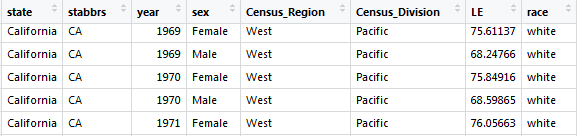

<!-- libraries -->
```{r,include=FALSE,purl=FALSE}
library(knitr) # for include_graphics() 
```

<!-- define default size for R graphics -->
```{r,include=FALSE,purl=FALSE}
outputFormat<-opts_knit$get('rmarkdown.pandoc.to')
if(outputFormat=="beamer"){
  opts_chunk$set(fig.width=6,fig.height=4)
}
```

<!-- define function for external images -->
```{r,include=FALSE,purl=FALSE}
image<-function(ff,ss,cc=NULL,ll=NULL){
  if(is.null(cc)){
    paste('\\centering','\n',
          '\\includegraphics[scale=',ss,']{',ff,'}',
          sep='')
  } else {
    paste('\\centering','\n',
          '\\copyrightbox[b]{',
          '\\includegraphics[scale=',ss,']{',ff,'}',
          '}{\\raggedleft{\\tiny \\href{',ll,'}{',cc,'}}}',
          sep='')    
  }
}
```

<!-- define function for links -->
```{r,include=FALSE,purl=FALSE}
link<-function(tt,ll){
  paste('[\\textcolor[HTML]{ffa328}{\\ul{',tt,'}}]','(',ll,')',sep='')
}
```

### Guess the date
In this year, UC Berkeley established a statistics department (split from mathematics) and hired David Blackwell - the first African American to receive tenure at UC Berkeley, and the first African American elected to the National Academy of Science (10 years later)


### Quote from Dr. Blackwell
Basically, I’m not interested in doing research and I never have been....I’m interested in understanding, which is quite a different thing. And often to understand something you have to work it out yourself because no one else has done it.

- quoted in a 2007 New York Times [article](https://www.nytimes.com/2010/07/17/education/17blackwell.html)

### What is this class?
In this class we are going to think about 

- **DATA** - How we gather, display and summarize information 

- **Probability ** - the role of chance 

- **Statistics** - the science of drawing statistical conclusions from data using a knowledge of probability

### Three parts

- Part I: learning to explore and summarize univariate and bivariate distributions.
- Part II: classical problems in probability and the some commonly used probability distributions and the central limit theorem
- Part III: statistical inference, the process of estimating statistics from samples to make inference about populations

### Goals for the semester
In addition the the learning objectives listed in your syllabus our overarching goals for the semester are to develop:

- your ability to critically assess statistical information presented to you in scientific and non-scientific fora
- your sense of how to approach answering real world questions with data
- your ability to concisely and accurately describe statistical methods and results

### This is not a math class

Statistics is often classified as a branch of math, but I'd argue that it is more important to **focus on the connections that statistics has with science** (how we can learn about the world through data)

Though it is true that statistics uses math (and sometimes fairly advanced math!), **not much math is needed** to learn introductory statistics 

In this class we will try, as much as possible, to **emphasize concepts** and help you develop your statistical intuition

### This is not a programming class

Statistics is often viewed as "just computer programming," but this is an incorrect and dangerous characterization: **computer programming is simply a tool for conducting statistical analysis**

The use of computer programming in statistics is---and should be---**quite different** than approaches to non-statistical programming

We are using r programming in this course because it is an extremely useful skill, facilitates computation, and is desired in the job market


### This is a relevant class

I hope to convince everyone here that statistics is relevant to everyone

As is more and more apparent, public health statistics have relevance to important policy decisions 

You also make many decisions during your day that are influenced by statistics 

Statistics is not just relevant for **public health**, but also for other professions, including: education, journalism and law

As we'll try to illustrate via the recurring "statistics is everywhere" segments, **statistics is useful for understanding the news** and the world around us

## Statistics is Everywhere

### Warning labels for coffee in California?

```{r, fig.align='center', out.width="60%", echo=FALSE }
knitr::include_graphics("warning.png")
```

**Warning regarding acrylamide** at a Starbucks location in Burbank, California.

### Warning labels for coffee in California?

- from *`r link('The New York Times','https://www.nytimes.com/2018/04/23/upshot/california-coffee-and-cancer-one-of-these-doesnt-belong.html')`*, April 2018:

> **California’s Proposition 65, enacted in 1986, mandates that businesses with more than 10 employees warn consumers if their products contain one of many chemicals that the state has ruled as carcinogenic.** 

- and:

> One of these chemicals is **acrylamide**. 

### Warning labels for coffee in California?

- from *`r link('The Los Angeles Times','http://www.latimes.com/local/lanow/la-me-coffee-tabels-20180329-story.html')`*, March 2018:

> **Acrylamide is created when coffee is roasted** and also is found in fried potatoes and burnt toast. It has been found to increase cancer risk in rodents. **Its effect on humans remains inconclusive.**


### Warning labels for coffee in California?

- more from the *New York Times* article:

> **we have a wealth of evidence about coffee's effects**. Meta analyses have shown that coffee is associated with lower risks of liver cancer, and no increased risk of prostate cancer or breast cancer. When we look at cancer over all, it appears that **coffee---if anything---is associated with a lower risk of cancer**.

### Warning labels for coffee in California?

- even more from the *New York Times* article:

> The more serious problem with California’s law is one of effect size. **Consumers can’t just be concerned with whether a danger exists; they also need to be concerned about the magnitude of that risk.** Even if there’s a statistically significant risk between huge quantities of coffee and some cancer (and that’s not proven), it’s very, very small. 


### Warning labels for coffee in California?
The scientific studies mentioned in these articles relied heavily on **statistics**
This example contains several concepts we will cover in this class including:

- The importance of where the data come from (sampling and target population)
- Mechanism for exposure assignment (random vs non-random)
- The importance of how much data are available (sample size)
- The quality of the data (measurement error)
- The concept of statistical association vs causal association 
- The difference between statistical significance and clinical significance


### Warning labels for coffee in California?
The international concensus...


 `r link('International Agency for Research on Cancer (IARC)','https://www.thelancet.com/journals/lanonc/article/PIIS1470-2045(16)30239-X/fulltext')`:

> coffee is *unclassifiable* with respect to carcinogenicity in humans


And more recently in California...

 `r link('from NPR','https://www.npr.org/2018/08/30/643246149/coffee-does-not-merit-cancer-warning-label-ordered-in-california-fda-says')`:

> FDA Commissioner Scott Gottlieb said in a statement that "if a state law purports to require food labeling to include a false or misleading statement, the FDA may decide to step in."

> He added that **a large body of research has found little evidence that coffee causes cancer**

> New regulation took effect Oct 1 2019 “Exposures to chemicals in coffee, listed on or before March 15, 2019, as known to the state to cause cancer, that are created by and inherent in the processes of roasting coffee beans or brewing coffee, do not pose a significant risk of cancer.”

### Warning labels for coffee in California?
As public health practitioners we are concerned with what happens to the public perception of science when these kinds of warnings are issued 

We should aim to be better at communicating our findings to inform policy and public opinion.

### Consequences of poor communication


## PPDAC - the approach we will use to answering questions with statistics

### Problem

A clear statement of what we are trying to achieve.


### Three main problem types

- **Descriptive**: learning about some particular attribute of a population
- **Causative/Etiologic**: do changes in an explanatory variable cause changes in a response variable?
- **Predictive**: how can we best predict the value of the response variable for an individual?

### Problem type?

- Insurance company:  What is the probability (how likely is it) that a 25 year old unmarried male driver has a car accident?

- Health department:  How many cases of influenza have we seen this season compared to last season?

- Health care system:  If we treat patients with diabetes using medication X, will thier insulin regulation be better or worse than medication y? 

### Plan

The procedures we use to carry out the study.

- **Census** or **sample** from the target population?
    - How was the sampling conducted?
    - Was the sample random?
- Is the study prospective or retrospective?
- Is the study observational or experimental?

### Data

The data which is collected according to the Plan. 

- How many observations to we have?
- How relaible are the measures?

### Analysis

The data is summarized and analysed to answer the questions posed by the Problem.

We use our knowledge about probabilities to assess the role of chance in our findings.

### Conclusion

Conclusions are drawn about what has been learned about answering the Problem.

## PPDAC Example 1: A smoking behaviour study

### PPDAC Example
Problem: Suppose we wish to study the smoking behavior of California residents aged
14-20 years. 

In particular, we are interested in the *prevalence* of current smoking by
gender.

What type of problem is this?

### PPDAC Example
Plan: We need to first choose a time period, because we know that smoking behavior 
has changed immensely over time. It is unfeasible to gather these data for all residents
in California who are 14-20 years old. 

Instead we conduct a *random sample* of size $n$ persons.
We collect their: age, gender, and smoking status.

Note that we need to decide how large $n$ should be, and how to obtain the random sample.
The latter question is, in particular, very important if we want to ensure that our sample is 
representative of the population of interest. Time and money also constrain how the sample
will be collected.

### PPDAC Example
Data: Suppose that a random sample of 200 persons aged 14-20 was selected, yielding these data:

|Gender                | Number of smokers | Number of non-smokers | Total |
|----------------------|-------------------|-----------------------|-------|
| Teen girls and women | 32 | 66 | 98  |
| Teen boys and men    | 27 | 75 | 102 |
| Total                | 59 | 141| 200 |

### PPDAC Example
Analysis: The proportion of women in the sample who smoke is 32/98 = 33%.
The proportion of men in the sample who smoke is 27/102 = 26%.

We would also like some idea as to how close this estimate is likely to be from the
actual proportion in the population. 

If we selected a second random sample of the same size, we would likely estimate different proportions for men and women. We 
will learn how to estimate the precision of these estimates.

### PPDAC Example
Conclusion: 33% of girls and women aged 14-20 and 26% of boys and men of the same
age group are current smokers in California in 2018 (plus a measure of uncertainty).


```{r lib-load, echo = FALSE, message=FALSE, warning=FALSE}
library(readr)
library(dplyr)
library(ggplot2)
library(tidyr)
library(glue)
```

```{r choose-your-state, echo=FALSE}
my_state <- "California"
```

## Example 2: Life expectancy for non-Hispanic black and white men and women in `r my_state` between 1969-2013

### Introduction 

Life expectancy is one of the core measures used in public health to comment on 
the well-being of groups of people. Differences in life expectancy by race/ethnicity,
for individuals living in the same region can reflect underlying inequalities in
policies, access to care, food environments, structural and systemic racism, among
other potential causes.

### Research objective (Problem)

The purpose of this short report is to visualize life expectancy among black and 
white men and women in `r my_state` between 1969 and 2013. 

We are interested in whether there are differences by group and whether these differences 
have changed over time.

What type of problem is this?

### Plan

Death certificates in the United States include race/ethnicity, age at death, 
and date of death and capture all deaths of US residents. These data are aggregated by the 
[CDC's National Cancer Institute](https://seer.cancer.gov/seerstat/) into the 
SEER*Stat software. Previously, Riddell et al.^1^, analyzed these data to 
compute estimated trends in life expectancy for non-Hispanic black and white men 
and women, for 40 US states between 1969 and 2013. States without enough data were
excluded from these analyses.

To carry out this short report, we will use data from Riddell et al. to 
visualize trends in life expectancy as part of an exploratory data analysis. In 
particular, we will plot time trends for black and white men and women in 
`r my_state`.

### Data

Here are the first few rows of these data for `r my_state`:
```{r import-and-filter-data, echo=F, message=F }
le_data <- read_csv("Life-expectancy-by-state-long.csv")

my_state_data <- le_data %>% 
  filter(state == my_state) %>%
  mutate(gender = case_when(sex == "Female" ~ "Women",
                            sex == "Male" ~ "Men")) %>%
  select(-sex)
```


### Analysis

```{r first-look-time-plots, echo=F, fig.width=12}
ggplot(data = my_state_data, aes(x = year, y = LE)) + 
  geom_line(aes(col = race)) + 
  facet_wrap(~ gender) +
  labs(y = "Life expectancy (years)",
       title = glue("Trends in life expectancy for black and white men and women in {my_state}")
  ) +
  theme_minimal(base_size = 15)
```

### Analysis

```{r reshape-and-compute-LE-difference, echo=F, fig.width=12}
my_state_data_wide <- my_state_data %>% 
  spread(key = race, value = LE) %>%
  mutate(le_difference = white - black)

ggplot(my_state_data_wide, aes(x = year, y = le_difference)) + 
  geom_line() +
  facet_wrap(~ gender) +
  labs(y = "Difference in life expectancy (years)",
       title = glue("Difference in life expectancy between black and white men and women in {my_state}")
       ) +
  theme_minimal(base_size = 15)
```

### Conclusion

The difference in life expectancy in 1969 between non-Hispanic blacks and whites was `r my_state_data_wide %>% filter(year == 1969, gender == "Men") %>% select(le_difference) %>% round(1)` years for men and `r my_state_data_wide %>% filter(year == 1969, gender == "Women") %>% select(le_difference) %>% round(1)` for women in `r my_state`. 

By 2013, the difference was `r my_state_data_wide %>% filter(year == 2013, gender == "Men") %>% select(le_difference) %>% round(1)` years for men and `r my_state_data_wide %>% filter(year == 2013, gender == "Women") %>% select(le_difference) %>% round(1)` for women in `r my_state`.

### References

The PPDAC method is described based on course notes from STAT 231 from the University of Waterloo (Ontario, Canada). Spring 2006 Course Packet.

1. Riddell CA, Morrison KT, Harper S, Kaufman JS. Trends in the contribution of major causes of death to the black-white life expectancy gap by US state. **Health & Place**. 2018. 52:85-100. doi: 10.1016/j.healthplace.2018.04.003.  


