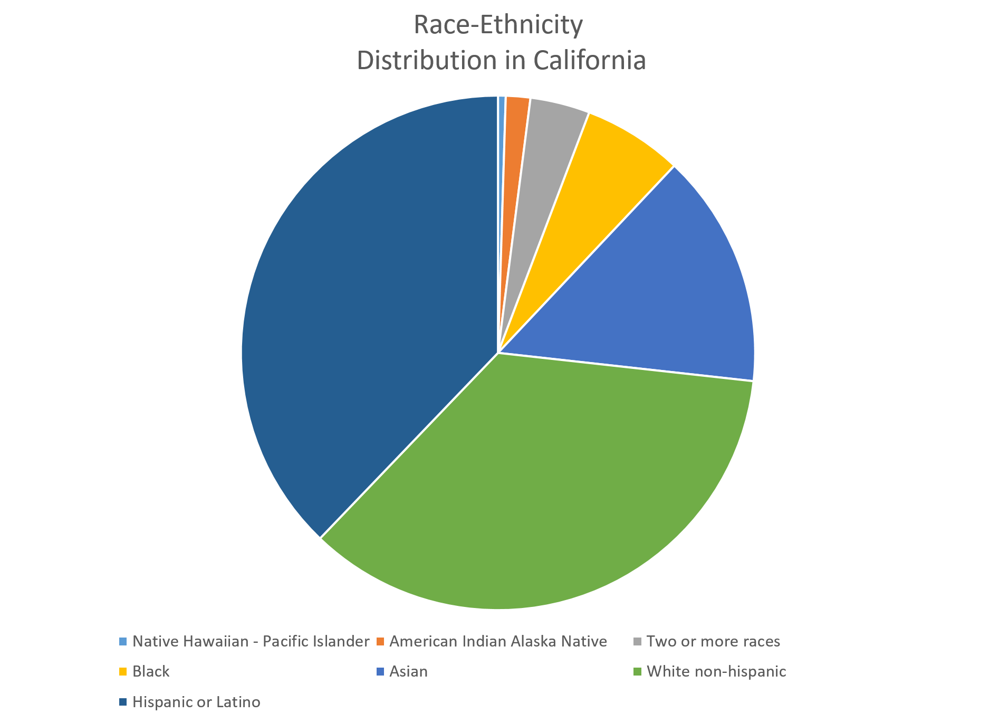

<!-- libraries -->
```{r,include=FALSE,purl=FALSE}
library(knitr) # for include_graphics() 
```


<!-- define function for external images -->
```{r,include=FALSE,purl=FALSE}
image<-function(ff,ss,cc=NULL,ll=NULL){
  if(is.null(cc)){
    paste('\\centering','\n',
          '\\includegraphics[scale=',ss,']{',ff,'}',
          sep='')
  } else {
    paste('\\centering','\n',
          '\\copyrightbox[b]{',
          '\\includegraphics[scale=',ss,']{',ff,'}',
          '}{\\raggedleft{\\tiny \\href{',ll,'}{',cc,'}}}',
          sep='')    
  }
}
```

<!-- define function for links -->
```{r,include=FALSE,purl=FALSE}
link<-function(tt,ll){
  paste('[\\textcolor[HTML]{ffa328}{\\ul{',tt,'}}]','(',ll,')',sep='')
}
```

```{r load-libraries, echo = F, message=F, warning=FALSE}
library(readr)
library(ggplot2)
library(dplyr)
library(forcats)
```

### Learning objectives for today:
Visualizing your data:

1. Making lovely plots using `ggplot` in R
 - Visualization of categorical data: use `ggplot`'s `geom_bar()`
 - Visualization of continuous data: use `ggplot`'s `geom_histogram()`
2. Describe distributions based on shape, center, spread


### Visualization of categorical data

- What is the best way to visualize one categorical variable at a time?

### Visualization of categorical data

- Generally speaking, **it is not a good idea to use pie charts** 

### Visualziation of categorical data

Can you judge the area of the slices?

```{r, out.width="70%", fig.align='center', echo=FALSE}

```


### Visualziation of categorical data

```{r, out.width="70%", fig.align='center', echo=FALSE}
knitr::include_graphics("ca-census-bar.png")
```

### Visualization of categorical data

- We prefer **bar graphs** (also called **bar charts**) for the display of categorical data. 
- Bar charts display the number or percent of data for each level of the categorical variable being plotted

### Example: infectious disease data

- Task: Make a bar chart of the percent of cases on infectious disease for each 
category of disease.
- First, read and view the infectious disease data from Baldi and Moore:

```{r make-bar-chart}
id_data <- read_csv("Ch01_ID-data.csv")
```

### Example: infectious disease data
```{r show-id}
id_data
```

### Example: infectious disease data
- Note the variables `number_cases` and `percent_cases`
- What do you want the bar chart to display? 
- What are the x and y variables for a bar chart?


## Introducing ggplot

### First step to building a `ggplot()`: set up the canvas

- The first line of code below pulls in the ggplot package
- The second line of code below specifies the `data` set and what goes on the `x` and `y` axes

```{r, fig.height = 4, fig.width = 9.5, echo=True}
library(ggplot2)
ggplot(id_data, aes(x = disease, y = percent_cases)) 
```

### Next choose a function

- We will use a `geom_` function to create our chart


`ggplot()`'s `geom_bar()` makes a bar chart


### Syntax for bar charts 

ggplot(id_data, aes(x = disease, y = percent_cases)) + 

  geom_bar(stat = "identity") 
  
 stat = "identity" tells geom_bar that we supplied a y variable that is exactly what we want to plot. 
 
 We do not need geom_bar() to calculate the number or percent for us.
 
### `ggplot()`'s `geom_bar()` makes a bar chart

```{r, fig.height = 4, fig.width = 9.5, echo=FALSE}
ggplot(id_data, aes(y=disease, x = number_cases)) + 
  geom_bar()
```

### some additions to ggplot for style


```{r, fig.height = 4, fig.width = 9.5, echo=FALSE}
ggplot(id_data, aes(x = disease, y = percent_cases)) + 
  geom_bar(stat = "identity") +
   labs(y = "Percent", x = "") +
  theme_minimal(base_size = 15) 
```

 base_size controls the font size on these plots
 
 theme_minimal affects the "look" of the plot it removes the grey background and adds grey gridlines


### `fct_reorder` reorders `disease` according to value of `percent_cases`

```{r bar-ordered, fig.height = 4, fig.width = 9.5}
id_data <- id_data %>% 
  mutate(disease_ordered = fct_reorder(disease, percent_cases, .desc = T))
```

### Re-ordered plot
```{r ordered, fig.height = 4, fig.width = 9.5, echo=FALSE}
ggplot(id_data, aes(x = disease_ordered, y = percent_cases)) + 
  geom_bar(stat = "identity") + 
  labs(y = "Percent", x = "") +
  theme_minimal(base_size = 15)
```

### Use `aes(fill = type)` to link the bar's fill to the disease type

  geom_bar(stat = "identity", aes(fill = type)) +

   theme(legend.position = "top")

### Use `aes(fill = type)` to link the bar's fill to the disease type
```{r bar-coloured, echo=FALSE, fig.height = 5, fig.width = 9.5}
ggplot(id_data, aes(x = disease_ordered, y = percent_cases)) + 
  geom_bar(stat = "identity", aes(fill = type)) +
  labs(y = "Percent", x = "") +
  theme_minimal(base_size = 15) +
  theme(legend.position = "top")
```

## Visualizing quantitative variables

### Visualize quantitative variables using histograms 

- Histograms look a lot like bar charts, except that the bars touch because the 
underlying scale is continuous and the order of the bars matters
- In order to make a histogram, the underlying data needs to be **binned** into 
categories and the number or percent of data in each category becomes the height 
of each bar. 
- the **bins** devide the entire range of data into a series of intervals and counts
the number of observations in each interval
- the intervals must be consecutive and non-overlapping and are almost always chosen to be of equal size

### Example:  opioid state prescription rates

- The textbook gives an example using data from 2012.
- In the data folder, there is updated data from 2018. It came from the paper:
“Opioid Prescribing Rates by Congressional Districts, United States, 2016”, by 
Rolheiser et al. [link](https://ajph.aphapublications.org/doi/10.2105/AJPH.2018.304532)

### Example:  opioid state prescription rates
Problem:  To determine the extent to which opioid prescribing rates vary across US congressional districts.

Plan: In an observational cross-sectional framework using secondary data, they constructed 2016 congressional district–level opioid prescribing rate estimates using a population-weighted methodology.

Data:  In the data structure we have State as the unit of analysis, and measured prescription rates as the variable of interest


### Example:  opioid state prescription rates

```{r read-opi-data}
opi_data <- read.csv("Ch01_opioid-data.csv")
head(opi_data)
```

- `Mean` provides the mean prescribing rate per 100 individuals. Thus, a mean
of 121.31 implies that in Alabama, there were 121.31 opioid prescriptions per 100 
persons, an average across the 7 congressional districts.

### Histogram of opioid prescription rates

- Task: Make a histogram of the average prescribing rates across US states
- What is the x variable? What is the y variable? 
- What `geom` should be used?

### Histogram of opioid prescription rates - default is 30 bins
ggplot(data = opi_data, aes(x = Mean)) + 

  geom_histogram(col = "white") +

  labs(x = "Mean opioid prescription rate (per 100 individuals)", 

       y = "Number of states") +

  theme_minimal(base_size = 15)
  
### Histogram of opioid prescription rates
```{r hist-binwidth-no-width-specified, fig.height = 4, fig.width = 8, echo=FALSE}
ggplot(data = opi_data, aes(x = Mean)) + 
  geom_histogram(col = "white") +
  labs(x = "Mean opioid prescription rate (per 100 individuals)", 
       y = "Number of states") +
  theme_minimal(base_size = 15)
```

### same graph, change the bins `geom_histogram(binwidth = 5)`
ggplot(data = opi_data, aes(x = Mean)) + 

  geom_histogram(col = "white", binwidth = 5) +
  
  labs(x = "Mean opioid prescription rate (per 100 individuals)", 
  
       y = "Number of states") +
  
  theme_minimal(base_size = 15)

### same graph, change the bins `geom_histogram(binwidth = 5)`
```{r hist-binwidth-5, fig.height = 4, fig.width = 8, echo=FALSE}
ggplot(data = opi_data, aes(x = Mean)) + 
  geom_histogram(col = "white", bins = 5) +
  labs(x = "Mean opioid prescription rate (per 100 individuals)", 
       y = "Number of states") +
  theme_minimal(base_size = 15)
```

### change the bins again `geom_histogram(binwidth = 10)`
ggplot(data = opi_data, aes(x = Mean)) + 
  
  geom_histogram(col = "white", binwidth = 10) +
  
  labs(x = "Mean opioid prescription rate (per 100 individuals)", 
  
       y = "Number of states") +
  
  theme_minimal(base_size = 15)

### change the bins again `geom_histogram(binwidth = 10)`
```{r hist-binwidth-10, fig.height = 4, fig.width = 8, echo=FALSE}
ggplot(data = opi_data, aes(x = Mean)) + 
  geom_histogram(col = "white", binwidth = 10) +
  labs(x = "Mean opioid prescription rate (per 100 individuals)", 
       y = "Number of states") +
  theme_minimal(base_size = 15)
```

## Describing your distribution based on shape, center and spread

### Shape, Center, Spread
- When we examine histograms, we can make comments on a distribution's:
    - **Shape**: Is the distribution **symmetric** or **skewed** to the left or right?
    - **Center**: Does the histogram have one peak (unimodal), or two (bimodal) or more?
    - **Spread**: How spread out are the values? What is the range of the data?
    - **Outliers**: Do any of the measurements fall outside of the range of most of the data points?
   
### Is this skewed left or skewed right? 
```{r, echo=F, out.width = "70%"}
knitr::include_graphics("us-household-income.png")
```


### Center - one hump or two?

```{r modal, echo=F, out.width = "60%"}
knitr::include_graphics("unibi.png")
```

### Outlier

```{r outs, echo=F, out.width = "50%"}
knitr::include_graphics("outlier.png")
```


## Time plots

### Visualize quantitative variables over time using time plots

- **Time plots** are a specific subset of plots where the x variable is time. 
- Unlike the previous plots, the time plot shows a relationship between two 
variables: 
    i) a quantitative variable 
    ii) time 
- Often times, these plots can be used to look for cycles (e.g., seasonal 
patterns that recur each year) or trends (e.g., overall increases or decreases 
seen over time).

### Time plot

- from *`r link('See California.com','http://www.seecalifornia.com/weather/oakland.html')`*, January 2021:

```{r Rain, echo=F, out.width = "70%"}
knitr::include_graphics("rainfall.png")
```


### Life expectancy for White men in California

Make a scatter plot of the life expectancy for White men in California
over time.

Since the dataset contains 39 states across two genders and two races, first use
a function to subset the data to contain only White men in California.

Which function from last lecture do we need?

* `mutate()`, `select()`, `filter()`, `rename()`, or `arrange()`?

### `dplyr`'s `filter()` to select a subset of rows

```{r wh-cali-dataset, echo=FALSE, warning=FALSE, message=FALSE}
library(dplyr)
le_data <- read_csv("Life-expectancy-by-state-long.csv")
```

```{r}
wm_cali <- le_data %>% filter(state == "California", 
                              sex == "Male", 
                              race == "white")

#this is equivalent:
wm_cali <- le_data %>% filter(state == "California" & sex == "Male" & race == "white")
```

### Here we use `geom_point` to make a graph with dots
ggplot(data = wm_cali, aes(x = year, y = LE)) + 

  geom_point() +
  
  labs(title = "Life expectancy in white men in California, 1969-2013",
  
       y = "Life expectancy", 
       
       x = "Year", 
       
       caption = "Data from Riddell et al. (2018)")

### Here we use `geom_point` to make a graph with dots
```{r ggplot-change-titles, out.width = "60%", fig.align='center', echo=FALSE}
ggplot(data = wm_cali, aes(x = year, y = LE)) + geom_point() +
  labs(title = "Life expectancy in white men in California, 1969-2013",
       y = "Life expectancy", 
       x = "Year", 
       caption = "Data from Riddell et al. (2018)")
```

### `geom_line()` to make a line plot
ggplot(data = wm_cali, aes(x = year, y = LE)) + 

  geom_line(col = "blue") +
  
  labs(title = "Life expectancy in white males in California, 1969-2013",
  
       y = "Life expectancy", 
       
       x = "Year", 
       
       caption = "Data from Riddell et al. (2018)")

### `geom_line()` to make a line plot
```{r ggplot-geom_line, out.width = "60%", fig.align='center', echo=FALSE}
ggplot(data = wm_cali, aes(x = year, y = LE)) + geom_line(col = "blue") +
  labs(title = "Life expectancy in white males in California, 1969-2013",
       y = "Life expectancy", 
       x = "Year", 
       caption = "Data from Riddell et al. (2018)")
```

### R Recap: new code?
1. 'ggplot' to set up a canvas for graphics
2. `geom_bar(stat = "identity")` to make a bar chart when you specify the y variable
3. `geom_histogram()` to make a histogram for which ggplot needs to calculate the count
4. `fct_reorder(var1, var2)` to reorder a categorical variable (`var1`) by a numeric variable (`var2`)
    - from the `forcats` package
5. `geom_point()` to make a plot with dots
6. `geom_line()` to make a plot with lines


### How to get help with code

- Ask questions during labs, GSI office hours, or on Piazza discussion forum. Use the appropriate thread!
- Develop your online search skills. For example if you have a `ggplot2` question, begin your google search with "r ggplot" and then describe your issues, e.g., "r ggplot how do I make separate lines by a second variable". 
- The most common links that will appear are:
    - https://stackoverflow.com: Crowd-sourced answers that have been upvoted. The top answer is often the best one.
    - https://ggplot2.tidyverse.org/: The official ggplot2 webpage is very helpful.
    - https://community.rstudio.com/: The RStudio community page.
    - https://rpubs.com/: Web pages made by R users that often contain helpful tutorials.
    
### We only skimmed the surface!

- Here is some extra material for those of you who love data visualization. This material won't be tested.
    - [RStudio ggplot2 cheatsheet](https://www.rstudio.com/wp-content/uploads/2015/03/ggplot2-cheatsheet.pdf)
    - [Kieran Healy's data visualization book](https://www.amazon.com/gp/product/0691181624/ref=as_li_tl?ie=UTF8&tag=kieranhealysw-20&camp=1789&creative=9325&linkCode=as2&creativeASIN=0691181624&linkId=16d53b3cc1ec3bc3aac60b27c29b92e8)


