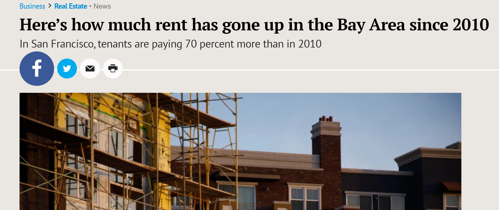

<!-- libraries -->
```{r,include=FALSE,purl=FALSE}
library(knitr) # for include_graphics() 
```


```{r load-libraries, echo = F, message=F, warning=FALSE}
library(ggplot2)
library(dplyr)
library(fGarch) # don't need to know what this library does (used to make the skewed distributions)
```


<!-- define function for external images -->
```{r,include=FALSE,purl=FALSE}
image<-function(ff,ss,cc=NULL,ll=NULL){
  if(is.null(cc)){
    paste('\\centering','\n',
          '\\includegraphics[scale=',ss,']{',ff,'}',
          sep='')
  } else {
    paste('\\centering','\n',
          '\\copyrightbox[b]{',
          '\\includegraphics[scale=',ss,']{',ff,'}',
          '}{\\raggedleft{\\tiny \\href{',ll,'}{',cc,'}}}',
          sep='')    
  }
}
```

<!-- define function for links -->
```{r,include=FALSE,purl=FALSE}
link<-function(tt,ll){
  paste('[\\textcolor[HTML]{ffa328}{\\ul{',tt,'}}]','(',ll,')',sep='')
}
```


### Learning objectives for today:
Describing your data:

1. Investigate measures of centrality
    - mean and median, and when they're the same vs. different
    
2. Investigate measures of spread
    - IQR, standard deviation, and variance
    
3. Create a visualization of the "five number summary"
    - boxplots using `ggplot`

4. Calculate the variance and standard deviation
    
    
## Measures of central tendency

### Measures of central tendency

- Most common: **mean** and **median**

### The arithmetic mean 

$$\bar{x} = \frac{x_1+x_2+...+x_n}{n}$$

$$\bar{x} = \sum_{i=1}^n \frac{x_i}{n}$$

$$\bar{x} = \frac{1}{n}\sum_{i=1}^n x_i$$

### The median
- Half of the measurements are larger and half are smaller. 

    - What is the median if there is an odd number of observations? 
    
    - An even number?
    


## Statistics is Everywhere

### Bay Area rent

```{r, out.width="70%", fig.align='center', echo=FALSE}
knitr::include_graphics("sf-rent.png")
```

[**From Hoodline.com**](https://hoodline.com/2020/01/apartments-for-rent-in-san-francisco-what-will-3-400-get-you-1580175175)

### Bay Area rent

```{r, out.width="70%", fig.align='center', echo=FALSE}

```

Now sitting at $3,680, average rent in San Francisco has soared 70 percent since 2010 while home prices climbed an eye-popping 95 percent and median income crept up a comparatively modest 61 percent.
Across the bay in Oakland, rent climbed even more — 108 percent.
 [**Mercury News article**](https://www.mercurynews.com/2019/12/20/heres-how-much-rent-has-gone-up-in-the-bay-area-since-2010/)
 
## Discussion


### When are these measures approximately equal?
- Answer: When the data has one peak and is roughly **symmetric**
    - In this case, the mean $\approx$ median, so provide either one in a summary 
 
- **Skewed** data
    - mean $\neq$ median
    - Right-skewed data will commonly have a `r #answer: higher`______ mean than median 
    - Left-skewed data will commonly have a `r #answer: lower`______ mean than median
    - Which statistic should we report? `r #it depends, the median gives a more typical value because 50% of measures are above and below, but the average is important when resource planning.` 

### Skewed data

```{r, echo = F, out.width="80%", out.height="80%", fig.align='center'}
# STUDENTS: YOU DON'T NEED TO KNOW THE CODE IN THIS CODE CHUNK USED TO MAKE THIS PLOT.
x <- seq(0,1,length=100)
db <- dbeta(x, 2, 5)
db2 <- dbeta(x, 8, 2)

ggplot() + 
  geom_line(aes(x,db, col = "skewed right"), lwd = 2) + 
  geom_line(aes(x,db2, col = "skewed left"), lwd = 2) +
  labs(y = "Density") + theme_minimal(base_size = 18) + 
  theme(legend.title = element_blank())
```    

### Apartment rent in SF

Problem:  We want to understand how much it costs for a new resident to rent a 1 bedroom apartment in San Francisco

Plan:  Take a sample of 1000 apartment units listed for rent (currently available) and ask the rental price (excluding utilities)

Data:  Here I will present data that I simulated in r using a mean value published on rentjungle.com
- you will not be expected to do this or be tested on it.


```{r distribution-ex, echo = F, message=FALSE, warning=FALSE}
# This code chunk simulates rent price distributions under varying assumptions.
# Note to students: you won't be tested on your understanding of this code chunk.

set.seed(1236)
rent_n <- 1000
rent_mean <- 3300
rent_sd <- 500
rent_skew_factor <- 5
rent_sym <- rnorm(n = rent_n, mean = rent_mean, sd = rent_sd)
rent_sym_out_left <- c(rent_sym[ seq(1, rent_n - 3) ], 1200, 1250, 1500)
rent_sym_out_right <- rent_sym + c(rep(0, rent_n - 3), 6000, 5000, 5500)
rent_left_skew <- rsnorm(
  n = rent_n, mean = rent_mean,
  sd = rent_sd, xi = 1 / rent_skew_factor
)
rent_right_skew <- rsnorm(
  n = rent_n, mean = rent_mean,
  sd = rent_sd, xi = rent_skew_factor
)
rent_bimodal <- c(
  rnorm(n = rent_n / 2, mean = rent_mean, sd = 300),
  rnorm(n = rent_n / 2, mean = 2000, sd = 300)
)

rent_data <- data.frame(
  sym = rent_sym,
  left_skew = rent_left_skew,
  sym_out_left = rent_sym_out_left,
  sym_out_right = rent_sym_out_right,
  right_skew = rent_right_skew,
  bimodal = rent_bimodal
)

rm(rent_sym, rent_left_skew, rent_sym_out_left, 
   rent_sym_out_right, rent_right_skew, rent_bimodal)

rent_summs <- rent_data %>%
  summarize_all(list(mean = mean, median=median))

### now sample only 100 apartments
rent_smaller_n <- 100

rent_sym_small <- rnorm(n = rent_smaller_n, mean = rent_mean, sd = rent_sd)
rent_sym_out_left_small <- c(rent_sym_small[ seq(1, rent_smaller_n - 3) ], 1200, 1250, 1500)
rent_sym_out_right_small <- rent_sym_small + c(rep(0, rent_smaller_n - 3), 6000, 5000, 5500)

rent_data_small <- data.frame(
  sym = rent_sym_small,
  sym_out_left = rent_sym_out_left_small,
  sym_out_right = rent_sym_out_right_small
)

rent_summs_small <- rent_data_small %>%
  summarize_all(funs(mean, median))

rm(rent_sym_out_left_small, rent_sym_out_right_small, rent_sym_small)
```

### Example: Apartment rent in SF
Suppose that the distribution of rent prices looked like this. The green ticks underneath the histograms shows you the exact rent values that 
contribute data to each bin. 

```{r sym-plot, echo = F, fig.width=7, fig.height=4}
sym_plot <- ggplot(rent_data, aes(x = sym)) +
  geom_histogram(binwidth = 200, col = "white") +
  labs(x = "Monthly Rent ($)", 
       y = "Count of apartments",
       title = "Symmetric distribution in rental prices ($)") +
  geom_vline(xintercept = rent_summs$sym_mean) +
  geom_vline(xintercept = rent_summs$sym_median, col = "blue") +
  geom_text(aes(x = rent_summs$sym_mean + 150, y = 20),
            label = "Mean", check_overlap = T) +
  geom_text(aes(x = rent_summs$sym_median - 150, y = 20),
            label = "Median", check_overlap = T, col = "blue") +
  geom_rug(col = "#005824", alpha = 0.5) + #hex colours (see link below)
  theme_minimal(base_size = 15)

sym_plot
```

[Hex color picker](https://www.google.com/search?q=hex+colors+picker&oq=hex+colour&aqs=chrome.2.69i57j0l5.3494j0j1&sourceid=chrome&ie=UTF-8)

### Example: Apartment rent in SF
From last lecture:  We describe this distribution in terms of center, shape and spread:

- Center: Where is the center of the distribution?

- Shape:  Is this distribution unimodal or bimodal? 

- Spread:  How much variability is there between the lowest and highest rent values?

### Example: Apartment rent in SF
Summarizing numerically:
Center: 

```{r numerics}
# in base R
mean(rent_data[,"sym"])
median(rent_data[,"sym"])
```

```{r}
# using the summarize function and a pipe operator 
rent_data %>% summarize(
  mean=mean(sym),
  median = median(sym))
```

## Mean vs Median:  Outliers and sample size, skew, shape 

### When are the mean and median approximately equal?
- If your data has one peak (unimodal), is roughly symmetric, and does not have outliers
    - mean $\approx$ median, so provide either one in a summary 
 
### Example: Apartment rent in SF
Now suppose that there were three rents within the data set with much larger 
values than the rest of the distribution. Here is the plot for this updated data.

```{r sym-outlier-high-plot, echo = F, fig.width=9, fig.height=4}
sym_out_right_plot <- ggplot(rent_data, aes(x = sym_out_right)) +
  geom_histogram(binwidth = 200, col = "white") +
  xlab("Monthly Rent ($)") + ylab("Count") +
  ggtitle("Symmetric, but with outliers on the right, n=1000") +
  geom_vline(xintercept = rent_summs$sym_out_right_mean) +
  geom_vline(xintercept = rent_summs$sym_out_right_median, col = "blue") +
  geom_text(aes(x = rent_summs$sym_out_right_mean + 350, y = 20),
            label = "Mean", check_overlap = T) +
  geom_text(aes(x = rent_summs$sym_out_right_median - 350, y = 20),
            label = "Median", check_overlap = T, col = "blue") +
  geom_rug(col = "#005824", alpha = 0.5) +
  theme_minimal(base_size = 15)

sym_out_right_plot
```

- With 1000 sampled points the outliers do not have a large effect on the mean

### Example: Apartment rent in SF
Imagine instead, there were only 100 sampled points. Here, the outliers have a 
larger effect on the mean. **The mean is not resistant to outliers.**

```{r sym-outlier-high-smaller-n, echo = F, fig.width=9, fig.height=4}
sym_out_right_plot <- ggplot(rent_data_small, aes(x = sym_out_right)) +
  geom_histogram(binwidth = 400, col = "white") +
  xlab("Monthly Rent ($)") + ylab("Count") +
  ggtitle("Symmetric, but with outliers on the right, n=100") +
  geom_vline(xintercept = rent_summs_small$sym_out_right_mean) +
  geom_vline(xintercept = rent_summs_small$sym_out_right_median, col = "blue") +
  geom_text(aes(x = rent_summs_small$sym_out_right_mean + 350, y = 20),
            label = "Mean", check_overlap = T) +
  geom_text(aes(x = rent_summs_small$sym_out_right_median - 350, y = 20),
            label = "Median", check_overlap = T, col = "blue") +
  geom_rug(col = "#005824", alpha = 0.5) +
  theme_minimal(base_size = 15)

sym_out_right_plot
```

### Example: Apartment rent in SF
Consider instead what happens if there are many high-end apartments in the area. Here is the histogram of data for this example:

```{r right-skew-plot, echo = F, fig.width=9, fig.height=4}
right_skew_plot <- ggplot(rent_data, aes(x = right_skew)) +
  geom_histogram(binwidth = 150, col = "white") +
  xlab("Monthly Rent ($)") + ylab("Count") +
  ggtitle("Right-Skewed") +
  geom_vline(xintercept = rent_summs$right_skew_mean) +
  geom_vline(xintercept = rent_summs$right_skew_median, col = "blue") +
  geom_text(aes(x = rent_summs$right_skew_mean + 150, y = 20), label = "Mean", check_overlap = T) +
  geom_text(aes(x = rent_summs$right_skew_median - 150, y = 20), label = "Median", check_overlap = T, col = "blue") +
  geom_rug(col = "#005824", alpha = 0.5) +
  theme_minimal(base_size = 15)
right_skew_plot
```

Why is the mean larger than the median in this case?

###Skewed data
- mean $\neq$ median
- Data with a long right tail will commonly have a `r #answer: higher`______ mean than median 
- Data with a long left tail  will commonly have a `r #answer: lower`______ mean than median
- Which statistic should we report? `r #it depends, the median gives a more typical value because 50% of measures are above and below, but the average is important when resource planning.` 
    
### Example: Apartment rent in SF
Now, suppose that the sample of estimates did not look like the distribution in the previous example. Instead, it looked like this: 

```{r bimodal-plot, echo = F, fig.width=9, fig.height=4}
bi_plot <- ggplot(rent_data, aes(x = bimodal)) +
  geom_histogram(binwidth = 250, col = "white") +
  xlab("Monthly Rent ($)") + ylab("Count") +
  ggtitle("Bimodal") +
  geom_vline(xintercept = rent_summs$bimodal_mean) +
  geom_vline(xintercept = rent_summs$bimodal_median, col = "blue") +
  geom_text(aes(x = rent_summs$bimodal_mean + 150, y = 20),
            label = "Mean", check_overlap = T) +
  geom_text(aes(x = rent_summs$bimodal_median - 150, y = 20),
            label = "Median", check_overlap = T, col = "blue") +
  geom_rug(col = "#005824", alpha = 0.5) +
  theme_minimal(base_size = 15)
bi_plot
```

Describe the distribution. How does it differ from the first plot? Would you want to provide the mean or median for these data? `r #ANSWER: No, you wouldn't because the center is not an appropriate descriptive statistic for a bimodal distribution. It lands between the two peaks and that doesn't accurately describe these data.`


### Summary of measures of central tendency

- The mean and median are similar when the distribution is symmetric 
- Outliers affects the mean and pull it towards their values. But they do not have a large effect on the median. 
- Skewed distributions also pull the mean out into the tail. 
- Measures of central tendency are not very helpful in multi-modal distributions

`r #Thought experiment. Imagine a symmetric distribution with no outliers. Then replace the max observed value with a value three times as large. How is the mean affected? How is the median affected?`

## Measures of spread

### The inter-quartile range (IQR)

- Q1 is the 1st quartile/the 25th percentile. 
    - 25% of individuals have measurements below Q1.

- Q2 is the 2nd quartile/the 50th percentile/the median. 
    - 50% of individuals have measurements below Q2.

- Q3, the 3rd quartile/the 75th percentile. 
    - 75% of individuals have measurements below Q3. 

- **Q1-Q3** is called the **inter-quartile range** (**IQR**). 
    - What percent of individuals lie in the IQR? `r #answer: the middle 50%`

- Know how to find Q1, Q2, and Q3 by hand for small lists of numbers

### Quantiles using R
`quantile(variable, 0.25)`

```{r quantiles}
rent_data %>% summarize(
  Q1 = quantile(sym, 0.25),
  median = median(sym),
  Q3 = quantile(sym, 0.75)
  )
```

### R's quantile function:  Note

- `quantile(variable, 0.25)` will not always give the exact same answer you 
calculate by hand
- The R function is optimized for its statistical properties and is slightly 
different than the book's method
- To get the exact same answer as by hand use `quantile(data, 0.25, type = 2)`
- You may use either one in this class. Most commonly, people do not specify
`type=2`

### Another measure of spread: The (full) range
- The difference between the **minimum** and **maximum** value

### Concise information about spread and center: The five number summary

- **The five number summary** (min, Q1,median,Q3, max) is a quick way to communicate a distribution's 
center and spread.
- Based on the summary you can describe the full range of a 
dataset, where the middle 50% of the data lie, and the middle value.

### `dplyr`'s summarize() to calculate the five number summary
Using our original example of rent data:

```{r five-number-summary2}
rent_data %>% summarize(
  min = min(sym),
  Q1 = quantile(sym, 0.25),
  median = median(sym),
  Q3 = quantile(sym, 0.75),
  max = max(sym)
)
```

## Example:  Hospital cesarean delivery rates

### Example:  Hospital cesarean delivery rates
These data were provided by the first author (Kozhimannil) of a manuscript 
published in the journal *Health Affairs*. [link](https://www.healthaffairs.org/doi/10.1377/hlthaff.2012.1030)

From the article:
Cesarean delivery is the most commonly performed surgical procedure in the United States, and cesarean rates are increasing. 
In its Healthy People 2020 initiative, the Department of Health and Human Services put forth clear, authoritative public health goals recommending a 10 percent reduction in both primary and repeat cesarean rates, from 26.5 percent to 23.9 percent, and from 90.8 percent to 81.7 percent, respectively.

A targeted approach to achieving such reductions might focus on hospitals with exceptionally high cesarean rates. However, adopting such a strategy requires quantification of hospital-level variation in cesarean delivery rates.

### Example:  Hospital cesarean delivery rates
Problem:  To characterize the variation in cesarean rates between Hospitals in the United States

Plan:  Collect existing data from a variety of institutions for one year and compare rates of cesarean delivery.
They also looked at cesarean rates among only low risk births at each institution.  Why might this be important?

Data:  For this article, they worked with 2009 data from 593 US hospitals nationwide

### Example:  Hospital cesarean delivery rates
We start by importing the data:

```{r import-tidy-cs-data, message=FALSE, warning=FALSE}
library(readxl) 
# this library helps with reading xlsx and xls files into R
CS_dat <- read_xlsx("Kozhimannil_Ex_Cesarean.xlsx", sheet = 1)
```

### Example:  Hospital cesarean delivery rates

```{r import-tidy-cs-data2}
head(CS_dat)
```

### Example:  Hospital cesarean delivery rates

```{r import-tidy-cs-data3}
names(CS_dat) 
```

let's take a moment to discuss variable names containing spaces

### Sidenote on variable names containing spaces

- Two variables in `CS_dat` contain spaces. 
- We generally want to remove spaces from variable names. 

* Question: Which `dplyr` function can we use to change the variable names?
* Answer: `rename(new_name = old_name)` can be used. When the old variable name contains spaces, you need to place back ticks around it like this: 


```{r rename-vars-with-spaces}
CS_dat <- CS_dat %>% rename(cs_rate = `Cesarean rate *100`,
                            low_risk_cs_rate = `Low Risk Cearean rate*100`)
```

- See [this paper](https://www.tandfonline.com/doi/abs/10.1080/00031305.2017.1375989) for tips on storing data in Excel for later analysis. 

### Tidy the data for analysis

For our example, we are only interested in each hospital's cesarean delivery rate,
the rate for lower risk pregnancies, and the number of births at the hospital.

```{r tidy-the-data}
CS_dat <- CS_dat %>%
  select(Births, cs_rate,low_risk_cs_rate) %>%
  rename(num_births = Births)
```

### Analysis: Histogram of cesarean delivery rates across US hospitals
ggplot(CS_dat, aes(x = cs_rate)) +
 
  geom_histogram(col = "white", binwidth = 5) +
 
  labs( x = "Cesarean delivery rate (%)", y = "Count",
 
    caption = "Data from: Kozhimannil, Law, and Virnig. Health Affairs. 2013;32(3):527-35.") +
 
  geom_rug(alpha = 0.2, col = "forest green") + #alpha controls transparency
 
  theme_minimal(base_size = 15)

### Histogram of cesarean delivery rates across US hospitals
```{r histogram-cs, fig.width=8, fig.height=4,echo=F}
ggplot(CS_dat, aes(x = cs_rate)) +
  geom_histogram(col = "white", binwidth = 5) +
  labs( x = "Cesarean delivery rate (%)", y = "Count",
    caption = "Data from: Kozhimannil, Law, and Virnig. Health Affairs. 2013;32(3):527-35.") +
  geom_rug(alpha = 0.2, col = "forest green") + #alpha controls transparency
  theme_minimal(base_size = 15)
```

### Spread of cesarean delivery rates across US hospitals
- What can you say about this distribution? Would you expect so much variation 
across hospitals in their rates of cesarean delivery? 
- Let's describe the **spread** of these data using the methods from Chapter 2.


### Quantiles 

```{r quantiles2}
CS_dat %>% summarize(
  Q1 = quantile(cs_rate, 0.25),
  median = median(cs_rate),
  Q3 = quantile(cs_rate, 0.75)
  )
```


### `dplyr`'s summarize() to calculate the five number summary
```{r five-number-summary}
CS_dat %>% summarize(
  min = min(cs_rate),
  Q1 = quantile(cs_rate, 0.25),
  median = median(cs_rate),
  Q3 = quantile(cs_rate, 0.75),
  max = max(cs_rate)
)
```

### Histogram of low risk cesarean delivery rates across US hospitals
```{r histogram-lcs, fig.width=8, fig.height=4,echo=F}
ggplot(CS_dat, aes(x = low_risk_cs_rate)) +
  geom_histogram(col = "white", binwidth = 5) +
  labs( x = "Low risk Cesarean delivery rate (%)", y = "Count",
    caption = "Data from: Kozhimannil, Law, and Virnig. Health Affairs. 2013;32(3):527-35.") +
  geom_rug(alpha = 0.2, col = "forest green") + #alpha controls transparency
  theme_minimal(base_size = 15)
```

### `dplyr`'s summarize() to calculate the five number summary
```{r five-number-summaryL}
CS_dat %>% summarize(
  min = min(low_risk_cs_rate),
  Q1 = quantile(low_risk_cs_rate, 0.25),
  median = median(low_risk_cs_rate),
  Q3 = quantile(low_risk_cs_rate, 0.75),
  max = max(low_risk_cs_rate)
)
```


## Sample variance and standard deviation

### Sample variance and standard deviation

Let $s^2$ represent the variance of a sample. Then,

$$s^2 = \frac{(x_1-\bar{x})^2 + (x_2-\bar{x})^2 + ... + (x_n-\bar{x})^2}{n-1}$$

$$s^2 = \frac{1}{n-1}((x_1-\bar{x})^2 + (x_2-\bar{x})^2 + ... + (x_n-\bar{x})^2)$$

$$s^2 = \frac{1}{n-1}\sum_{i=1}^n(x_i-\bar{x})^2$$

Let $s$ represent the standard deviation of a sample. Then,

$$s = \sqrt{\frac{1}{n-1}\sum_{i=1}^n(x_i-\bar{x})^2}$$

### Sample variance and standard deviation

- Some intuition on why we divide by n-1: [link](https://www.khanacademy.org/math/ap-statistics/summarizing-quantitative-data-ap/more-standard-deviation/v/review-and-intuition-why-we-divide-by-n-1-for-the-unbiased-sample-variance)

### `dplyr`'s summarize() to calculate the standard deviation and the variance
```{r five-number-summary-plus, echo = T}
CS_dat %>% summarize(
  cs_sd = sd(cs_rate),
  cs_var = var(cs_rate)
)
```

### Example:  Hospital cesarean delivery rates

What might we conclude from these data?

### Example:  Hospital cesarean delivery rates
From the article:

"we found that cesarean rates varied tenfold across hospitals, from 7.1 percent to 69.9 percent. Even for women with lower-risk pregnancies, in which more limited variation might be expected, cesarean rates varied fifteenfold, from 2.4 percent to 36.5 percent. Thus, vast differences in practice patterns are likely to be driving the costly overuse of cesarean delivery in many US hospitals. "

## Box plots

### Box plots provide a nice visual summary of the center and spread
Also called box and whisker plots

The box:

- The centre line is the median
- The top of the box is the Q3
- The bottom of the box is the Q1

The whiskers - depends:

- The top of the top whisker is either the max value, or equal to the highest point that is below Q3 + 1.5*IQR
- The bottom of the bottom whisker is either min value, or equal to the lowest point that is above Q1 - 1.5*IQR
- In plots where the whiskers are **not** the min and max, the data points above and below the whiskers are the outliers

### Box plots in R 

ggplot(CS_dat, aes(y = cs_rate)) +
 
  **geom_boxplot**() +
 
  ylab("Cesarean delivery rate (%)") +
 
  labs(title = "Box plot of the CS rates across US hospitals",
 
       caption = "Data from: Kozhimannil et al. 2013.") +
 
  theme_minimal(base_size = 15) +
 
  scale_x_continuous(labels = NULL)   # removes the labels from the x axis

### Box plots provide a nice visual summary of the center and spread
```{r box-plot-ex, width = 2, fig.width = 4.5, fig.height = 5.5, echo=F}
ggplot(CS_dat, aes(y = cs_rate)) +
  geom_boxplot() +
  ylab("Cesarean delivery rate (%)") +
  labs(title = "Box plot of the CS rates across \nUS hospitals",
       caption = "Data from: Kozhimannil et al. 2013.") +
  theme_minimal(base_size = 15) +
  scale_x_continuous(labels = NULL) 
  # removes the labels from the x axis
```


### R Recap: What new functions did we use?
1. `quantile(data, 0.25)`, `quantile(data, 0.75)` for Q1 and Q3, respectively
2. `min()` and `max()` for the full range of the data
3. `sd()` and `var()` for sample standard deviation and variance
4. Used the above within `summarize()` to easily output these measures
4. `ggplot`'s `geom_boxplot`

### Parting Humor

```{r, out.width="70%", fig.align='center', echo=FALSE}
knitr::include_graphics("box-cats.jpg")
```
    
