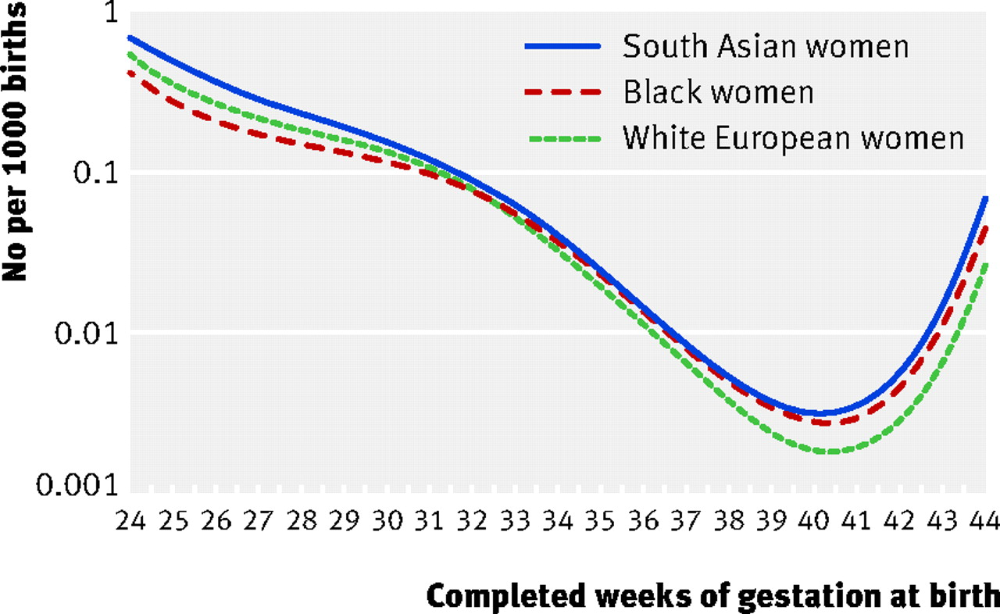
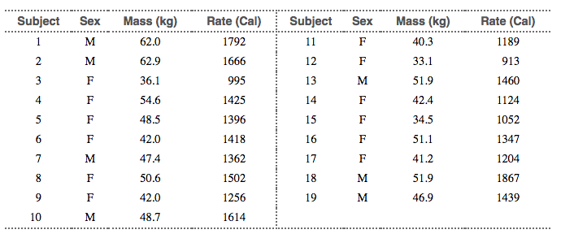
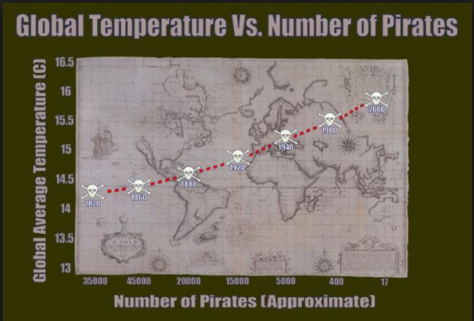

<!-- libraries -->
```{r,include=FALSE,purl=FALSE}
library(knitr) # for include_graphics() 
library(readr)
library(ggplot2)
library(dplyr)
```

<!-- define default size for R graphics -->
```{r,include=FALSE,purl=FALSE}
outputFormat<-opts_knit$get('rmarkdown.pandoc.to')
if(outputFormat=="beamer"){
  opts_chunk$set(fig.width=6,fig.height=4)
}
```

<!-- define function for external images -->
```{r,include=FALSE,purl=FALSE}
image<-function(ff,ss,cc=NULL,ll=NULL){
  if(is.null(cc)){
    paste('\\centering','\n',
          '\\includegraphics[scale=',ss,']{',ff,'}',
          sep='')
  } else {
    paste('\\centering','\n',
          '\\copyrightbox[b]{',
          '\\includegraphics[scale=',ss,']{',ff,'}',
          '}{\\raggedleft{\\tiny \\href{',ll,'}{',cc,'}}}',
          sep='')    
  }
}
```

<!-- define function for links -->
```{r,include=FALSE,purl=FALSE}
link<-function(tt,ll){
  paste('[\\textcolor[HTML]{ffa328}{\\ul{',tt,'}}]','(',ll,')',sep='')
}
```


### Recap of chapters 1 and 2

Mostly looking at a single variable:

- Graphs to explore the distribution of single variables (histograms, bar charts)

- Summary numbers to describe our distributions:
    - Measures of central tendency (mean, median) 
    - Measures of spread (standard deviation, IQR)

One example of two variables:

- Time plots to examine what happens to a variable over time

### Learning objectives for today

- Explore the relationship between two quantitative variables
    - Directionality
    - Association vs causation

- Make scatter plots to look at relationships visually
    - using `geom_point()` 

- Use the correlation coefficient to quantify the strength of linear relationships
    - calculate correlations using `cor()`
   
##Relationships between two quantitative variables

### Explanatory (X) and response (Y) variables 

**Bi-directional:** 

- "X predicts Y", or "Y predicts X"
- "X is associated with Y", or "Y is associated with X"

**Unidirectional:**

- "X causes Y"

### Which variable is x and which is y?

In prediction we generally use X to denote the variable we are using to predict the variable of interest (Y)

In causation we generally use X to denote the explanatory (independent) and Y to denote the response (dependent)

Graphically the X variable is on the X (horizontal) axis and the Y variable is the Y(vertical) axis

### Which variable is x and which is y?

1. Each hospital’s rate of hospital-acquired infections, and whether the hospital has implemented a
hand-washing intervention as part of a cluster randomized trial.

2. The weight in kilograms and height in centimeters of a person

3. Inches of rain in the growing season and the yield of corn in bushels per day

4. A person's leg length and arm length, in centimeters


### How to investigate causation?

- Randomized controlled trials (RCTs) to randomize individuals to different levels 
- Observational study that is *designed* to investigate causation and reduce the risk of bias

## Looking at relationships visually:  Scatterplots

###Scatterplots
- Scatterplots are a good way to visualize a relationship between two variables

- When we look at a scatterplot we want to evaluate:
  - The overall Pattern of the dots
  - Any notable exceptions to the pattern
  - Direction (positive or negative)
  - Form (straight line or curved)
  - Strength (how closely the points follow a line)
  - Are there any obvious outliers

###Scatterplot Syntax in R
  
 **name of plot** <- ggplot(data = **dataset**, aes(x = **xvariable**, y = **yvariable**)) + 
 
  geom_point(na.rm=TRUE) + theme_minimal(base_size = 15)+
 
  labs(x = "**xlabel**", 
       y = "**ylabel**",
       title = "**Title**")
       
###Bi-directional relationships ex: systolic and diastolic BP

Read in NHANES dataset
```{r importnhanes, echo=T, message=F}
nhanes_dataNA <- read_csv("nhanes.csv")
nhanes_data<-nhanes_dataNA[rowSums(is.na(nhanes_dataNA[ , 15:18])) == 0, ]
names(nhanes_data)
```

###Bi-directional relationships ex: systolic and diastolic BP
```{r plotnhanes,  message=F}
nhanes_scatter <- ggplot(data = nhanes_data, aes(x = bpxsy1, y = bpxdi1)) + 
  geom_point(na.rm=TRUE) + theme_minimal(base_size = 15)+
  labs(x = "Systolic BP", 
       y = "Diastolic BP",
       title = "NHANES Data")
```

###Bi-directional relationships ex: systolic and diastolic BP
```{r plotnhanes2, echo=FALSE}
nhanes_scatter

```


###Bi-directional relationships ex: systolic and diastolic BP
What do we notice from the plot?

  - Is there a visible association?
  - Any notable exceptions to the pattern
  - Direction (positive or negative)
  - Form (straight line or curved)
  - Strength (how closely the points follow a line)
  - Are there any obvious outliers

###Bi-directional relationships ex: systolic and diastolic BP
We can add a third variable to our graph by coloring the dots

```{r plotnhanes3,  message=F}
nhanes_scatter <- ggplot(data = nhanes_data, aes(x = bpxsy1, y = bpxdi1)) + 
  geom_point(aes(col=gender),na.rm=TRUE) + theme_minimal(base_size = 15)+
  labs(x = "Systolic BP", 
       y = "Diastolic BP",
       title = "NHANES Data")
```

###Bi-directional relationships ex: systolic and diastolic BP
```{r plotnhanes4, echo=FALSE}
nhanes_scatter

```

### Association with a plausible direction
Manatee data set from your textbook:
```{r import.mana.data, message=FALSE}
mana_data <- read_csv("Ch03_Manatee-deaths.csv")
head(mana_data)
```

###Power boats and Manatees
```{r scatter-plot-mana}
mana_scatter <- ggplot(data = mana_data, aes(x = powerboats, y = deaths)) + 
  geom_point() + theme_minimal(base_size = 15)
```

###Power boats and Manatees
```{r mana2, out.width="80%", echo=FALSE}
mana_scatter
```

###Power boats and Manatees
What do we notice from the plot?

  - Is there a visible association?
  - Any notable exceptions to the pattern
  - Direction (positive or negative)
  - Form (straight line or curved)
  - Strength (how closely the points follow a line)
  - Are there any obvious outliers

###Power boats and Manatees
What if we layer in a continuous third variable?

```{r scatter-plot-mana3}
mana_scatter <- ggplot(data = mana_data, aes(x = powerboats, y = deaths)) + 
  geom_point(aes(col=year)) + theme_minimal(base_size = 15)
```

###Power boats and Manatees
```{r scatter-plot-mana4, out.width="80%", echo=FALSE}
mana_scatter
```
  
###Enzyme activity and temperature
Also from your book:  A study examined the activity rate (in micromoles per second) of a digestive 
enzyme at varying temperatures.

```{r read-enzyme-data,echo=F, message=FALSE}
# this dataset was provided in Baldi and Moore Ed#4 Apply your knowledge 3.4 
enzyme_data <- read_csv("Ch03_Enzyme-data.csv")
head(enzyme_data)
```

###Enzyme activity and temperature
```{r enzgraph, echo=FALSE}
enzyme_scatter <- ggplot(data = enzyme_data, aes(x = temperature, y = rate)) + 
  geom_point() + theme_minimal(base_size = 15)

enzyme_scatter
```

###Enzyme activity and temperature
What do we notice from the plot?

  - Is there a visible association?
  - Any notable exceptions to the pattern
  - Direction (positive or negative)
  - Form (straight line or curved)
  - Strength (how closely the points follow a line)
  - Are there any obvious outliers
  

### Another non-linear example 

**Gestational age and perinatal mortality**

```{r, out.width="80%", echo=F}

```

Source: [Balchin et al. BMJ. 2007.](https://www.bmj.com/content/334/7598/833)

##Exploratory analysis using scatterplots

###Lean body mass and metabolic rate: Problem and Plan

Problem: Is lean body mass (person's weight after removing the fat) associated 
with metabolic rate (kilocalories burned in 24 hours)?

Plan: A diet study was conducted on 12 women and 7 men that measured lean body 
weight and metabolic rate for each individual.

### Lean body mass and metabolic rate: DATA

Data:  In the textbook

```{r energy, echo=F, out.width = "80%"}

```

What would the corresponding data frame look like? How many variables would it have? How many rows?

### Lean body mass and metabolic rate: DATA

```{r energy2}
# Note: you won't be tested on writing code using tibble::tribble()
# Do be able to look at the code and recognize that it is creating a data set

weight_data <- tibble::tribble(
  ~subject, ~gender, ~mass, ~rate,
  1, "M", 62.0, 1792,
  2, "M", 62.9, 1666,
  3, "F", 36.1, 995, 
  4, "F", 54.6, 1425, 
  5, "F", 48.5, 1396, 
  6, "F", 42.0, 1418, 
  7, "M", 47.4, 1362, 
  8, "F", 50.6, 1502,
  9, "F", 42.0, 1256, 
  10, "M", 48.7, 1614,
  11, "F", 40.3, 1189,
  12, "F", 33.1, 913,
  13, "M", 51.9, 1460,
  14, "F", 42.4, 1124,
  15, "F", 34.5, 1052,
  16, "F", 51.1, 1347,
  17, "F", 41.2, 1204,
  18, "M", 51.9, 1867,
  19, "M", 46.9, 1439
)
```

### Lean body mass and metabolic rate:  Analysis

Exploratory data analysis using scatter plots
```{r scatter-energy-data, out.width="80%"}
weight_scatter <- ggplot(weight_data, aes(x = mass, y = rate)) +
  geom_point() + 
  theme_minimal(base_size = 15)
```
### Lean body mass and metabolic rate:  Analysis
```{r energy3, out.width="80%", echo=FALSE}
weight_scatter
```

### Analysis: Colour the points by gender
```{r scatter-energy-data-col, out.width="80%"}
weight_scatter <- ggplot(weight_data, aes(x = mass, y = rate)) +
  geom_point(aes(col=gender)) + 
  theme_minimal(base_size = 15)
```

### Analysis: Colour the points by gender
```{r energy5, out.width="80%", echo=FALSE}
weight_scatter
```

### Analysis: Create separate plots for men and women
```{r facetted-scatter-energy-data}
weight_scatter <- ggplot(weight_data, aes(x = mass, y = rate)) +
  geom_point(aes(col=gender)) + 
  theme_minimal(base_size = 15)+
  facet_wrap(~ gender)
```

### Analysis: Create separate plots for men and women
```{r facetted-scatter-energy-data2, out.width="80%"}
weight_scatter
```

## Participation

\newpage

## Assessing a relationship between two variables with a number:  Pearson's correlation

### Pearson's correlation

Using just our eyes, we can often say something about whether an association 
between two variables is weak or strong. 

But we can also use a numeric value to describe the direciton and strength of an association


### Pearson's correlation

- For **linear** associations, we can use **Pearson's correlation coefficient** 
(denoted by $r$) to **quantify the strength** of a linear relationship between two 
variables.

- The correlation between $x$ and $y$ is:

$$r=\frac{1}{n-1}\sum_{i=1}^n(\frac{x_i-\bar{x}}{s_x})(\frac{y_i-\bar{y}}{s_y})$$
Notice that because we are dividing by the standard deviation the values become unitless

### Intuition about Pearson's correlation

To understand this formula, first only consider the numerators of the fractions 
(i.e., $x_i-\bar{x}$ and $y_i-\bar{y}$). If you imagine a scatter plot of x and 
y, we can also add a dashed line at the mean x value of $\bar{x}$ and a dashed 
line line at the mean y value ($\bar{y}$): 

```{r, echo=F, out.width="50%", fig.height=5, fig.align='center'}
# Note: you do not need to understand any of the code in this chunk 
# just focus on the description of what I am trying to show you in lecture.

x <- 1:20
y <- 2 * x + 3 + rnorm(20, 0, 9)
corr_data <- data.frame(x, y)

corr.plot <- ggplot(corr_data, aes(x,y)) + 
  geom_text(aes(x = 5, y = 35), label = 1, size = 60, col = "cadetblue1") +
  geom_text(aes(x = 15, y = 35), label = 2, size = 60, col = "cadetblue1") +
  geom_text(aes(x = 5, y = 10), label = 3, size = 60, col = "cadetblue1") +
  geom_text(aes(x = 15, y = 10), label = 4, size = 60, col = "cadetblue1") +
  geom_point() + 
  geom_hline(yintercept = mean(y), lty = 2) +
  geom_vline(xintercept = mean(x), lty = 2) + 
  theme_minimal(base_size = 15) 

corr.plot
```
### Intuition about Pearson's correlation

$r=\frac{1}{n-1}\sum_{i=1}^n(\frac{x_i-\bar{x}}{s_x})(\frac{y_i-\bar{y}}{s_y})$

```{r, echo=F, fig.height = 5, out.width="50%"}
corr.plot
```

- Points in Q2 and Q3 contribute positive products to $r$ 
- Points in Q1 and Q4 contribute negative products to $r$

### Intuition about Pearson's correlation
```{r, echo=F, fig.height = 5, out.width="50%"}
corr.plot
```

- The more there are points in Q2 and Q3 vs. Q1 and Q4, the more the value
of the correlation coefficient will be higher and positive
- If you want even more of an explanation see the response to this [stack overflow post](https://stats.stackexchange.com/questions/18058/how-would-you-explain-covariance-to-someone-who-understands-only-the-mean/18200#18200)

### Properties of the correlation coefficient

- Always a number between -1 and 1.
    - -1: A perfect, negative linear association
    - 1: A perfect, positive linear association
    - 0: No linear association 

- Is used to measure the association between two *quantitative* variables.
- Only useful for *linear* associations! 

\newpage
###Corellation and direction

```{r corr.plots, out.width="95%", echo=F, comment=NA, message=FALSE}
# Note: you do not need to understand any of the code in this chunk 
library(MASS)
library(patchwork) 
set.seed(123)

cor_100 <- as.data.frame(mvrnorm(100, mu = c(0,0), 
                     Sigma = matrix(c(1 ,1, 1, 1), ncol = 2), 
                     empirical = TRUE))

cor_70 <- as.data.frame(mvrnorm(100, mu = c(0,0), 
                     Sigma = matrix(c(1,0.7,0.7,1), ncol = 2), 
                     empirical = TRUE))

cor_30 <- as.data.frame(mvrnorm(100, mu = c(0,0), 
                     Sigma = matrix(c(1,0.3,0.3,1), ncol = 2), 
                     empirical = TRUE))

cor_n10 <- as.data.frame(mvrnorm(100, mu = c(0,0), 
                     Sigma = matrix(c(1,-0.1,-0.1,1), ncol = 2), 
                     empirical = TRUE))

cor_n40 <- as.data.frame(mvrnorm(100, mu = c(0,0), 
                     Sigma = matrix(c(1,-0.4,-0.4,1), ncol = 2), 
                     empirical = TRUE))

cor_n100 <- as.data.frame(mvrnorm(100, mu = c(0,0), 
                     Sigma = matrix(c(1,-1,-1,1), ncol = 2), 
                     empirical = TRUE))

cor_100_plot <- ggplot(cor_100, aes(V1, V2)) + geom_point() + 
  labs(title = "Correlation = 1", y = "y", x = "x") + 
  geom_hline(yintercept = mean(cor_100$V2), lty = 2) + 
  geom_vline(xintercept = mean(cor_100$V1), lty = 2) + 
  theme_minimal(base_size = 15) 

cor_70_plot <- ggplot(cor_70, aes(V1, V2)) + geom_point() + 
  labs(title = "Correlation = 0.7", y = "y", x = "x") + 
  geom_hline(yintercept = mean(cor_70$V2), lty = 2) + 
  geom_vline(xintercept = mean(cor_70$V1), lty = 2) + 
  theme_minimal(base_size = 15)

cor_30_plot <- ggplot(cor_30, aes(V1, V2)) + geom_point() + 
  labs(title = "Correlation = 0.3", y = "y", x = "x") + 
  geom_hline(yintercept = mean(cor_30$V2), lty = 2) + 
  geom_vline(xintercept = mean(cor_30$V1), lty = 2) + 
  theme_minimal(base_size = 15)

cor_n10_plot <- ggplot(cor_n10, aes(V1, V2)) + geom_point() + 
  labs(title = "Correlation = -0.1", y = "y", x = "x") +
  geom_hline(yintercept = mean(cor_n10$V2), lty = 2) + 
  geom_vline(xintercept = mean(cor_n10$V1), lty = 2) + 
  theme_minimal(base_size = 15)

cor_n40_plot <- ggplot(cor_n40, aes(V1, V2)) + geom_point() + 
  labs(title = "Correlation = -0.4", y = "y", x = "x") +
  geom_hline(yintercept = mean(cor_n40$V2), lty = 2) + 
  geom_vline(xintercept = mean(cor_n40$V1), lty = 2) + 
  theme_minimal(base_size = 15)

cor_n100_plot <- ggplot(cor_n100, aes(V1, V2)) + geom_point() + 
  labs(title = "Correlation = -1", y = "y", x = "x") +
  geom_hline(yintercept = mean(cor_n100$V2), lty = 2) + 
  geom_vline(xintercept = mean(cor_n100$V1), lty = 2) + 
  theme_minimal(base_size = 15)

cor_100_plot + cor_70_plot + cor_30_plot + 
cor_n10_plot + cor_n40_plot + cor_n100_plot 
```


### Syntax: Pearson's correlation using `cor()`

**correlation coefficient** <- **dataset** %>% 

  summarize(*newvar* = cor(**xvar**, **yvar**))

### Syntax: Pearson's correlation using `cor()`
Remember the manatee plot and the weight plot:

```{r show-scatters, fig.width = 9, fig.height=4, fig.align="centre", echo=F, message=F}
mana_scatter + weight_scatter + plot_layout() # you don't need to know the plot_layout() function
```

### Syntax: Pearson's correlation using `cor()`
Now, calculate the correlations between X and Y for manatees:
```{r calc-corr}
mana_cor <- mana_data %>% 
  summarize(corr_mana = cor(powerboats, deaths))
mana_cor
```

### Syntax: Pearson's correlation using `cor()`
And for the weight data:
```{r calc-corr2}
weight_cor <- weight_data %>% 
  summarize(corr_weight = cor(mass, rate))
weight_cor
```

### Syntax: Pearson's correlation using `cor()`
What about our blood pressure data from NHANES?

```{r bp, echo=FALSE}
nhanes_scatter 
```

### Syntax: Pearson's correlation using `cor()`
```{r bp2}
bp_cor <- nhanes_data %>% 
  summarize(corrbp = cor(bpxsy1, bpxdi1))
bp_cor
```

### Properties of the correlation coefficient
The correlation coefficient is not resistant to outliers, notice what happens when we add two outliers (in red) to the weight_data and recalculate correlation

```{r add-outliers-to-dataset, echo = F, message=F}
#students, you don't need to know the code in this chunk
weight_data_outliers <- tibble::tribble(
  ~subject, ~gender, ~mass, ~rate,
  20, "M", 62.0, 1213,
  21, "M", 55.9, 1150
  )

weight_data_and_out <- dplyr::full_join(weight_data, weight_data_outliers)
```

```{r plot-with-outliers-and-calc-correlation, out.width="95%", echo = F, message=F, warning=FALSE}
library(glue) #students, don't need to understand the use of glue here or below to make the label.

weight_cor_out <- weight_data_and_out %>% summarize(corr_out = cor(mass, rate))

weight_scatter_out <- ggplot(weight_data_and_out, aes(x = mass, y = rate)) + 
  geom_point(aes(col = subject >= 20)) +
  scale_color_manual(values = c("black", "red"), guide = FALSE) +
  theme_minimal(base_size = 15) +
  geom_text(x = 37, y = 1750, 
            label = glue("r = {round(weight_cor_out$corr_out, 2)}"), 
            check_overlap = T)

weight_scatter <- weight_scatter + 
  geom_text(x = 37, y = 1750, 
            label = glue("r = {round(weight_cor$corr_weight, 2)}"), 
            check_overlap = T)

weight_scatter + weight_scatter_out + plot_layout()
```


### Properties of the correlation coefficient

- Correlations for average measures is typically stronger than correlations for 
individual data

```{r build-breakup-dataset, echo=F, out.width="95%", fig.align=T, fig.height=5}
# Example data from 3.8 in Baldi and Moore (page 81 of 4th ed)
# students don't need to know this code, just pay attention to what I say about the plot
# and the correlation of mean scores vs. individual scores

distress_score <- c(rnorm(26, mean = 3.3, sd = 0.25), 
                    rnorm(26, mean = 3.1, sd = 0.25),
                    rnorm(26, mean = 2.9, sd = 0.25),
                    rnorm(26, mean = 2.6, sd = 0.25))

ID <- rep(1:26, 4)

time_since_breakup <- c(rep(0, 26), rep(2, 26), rep(6, 26), rep(10, 26))

breakup_data <- data.frame(ID, time_since_breakup, distress_score)

corr_raw <- breakup_data %>% summarize(corr = cor(time_since_breakup, distress_score))

mean_scores <- breakup_data %>% 
  group_by(time_since_breakup) %>%
  summarize(mean_distress_per_week = mean(distress_score))

corr_means <- mean_scores %>% 
  summarize(corr_with_means = cor(time_since_breakup, mean_distress_per_week))

ggplot(breakup_data, aes(x = time_since_breakup, y = distress_score)) + 
  geom_point(pch = 4, aes(col = "individuals")) +
  geom_point(data = mean_scores, aes(y = mean_distress_per_week, col = "mean"), size = 3) +
  theme_minimal(base_size = 15) +
  theme(legend.title = element_blank()) +
  geom_text(x = 8, y = 3.5, label = glue("Corr. of raw data = {round(corr_raw$corr, 2)}"), check_overlap = T) +
  geom_text(x = 8, y = 3.25, label = glue("Corr. of means = {round(corr_means$corr_with_means, 2)}"), check_overlap = T) +
  labs(x = "Time since breakup", y = "Distress score")
```

### Important concepts

- Determine which variable is explanatory and which is response, or when it doesn't matter

- Visually describe the relationship between two variables (form, direction, strength, and outliers)

- Numerically describe the relationship with the correlation coefficient $r$


### R Recap: What functions did we use?

- `geom_point()`,
- `aes(col = gender)` to color points by levels of `gender`
- `summarize()` to calculate correlation using `cor(var1, var2)`


### Reminder: Association does not equal causation

Remember that just because two variables are associated, does not mean there is a causal relationship

The correlation coefficient measures association *not* causation. 

Even a very strong association doesn't mean that one variable causes the other.

### Reminder: Association does not equal causation

```{r, fig.height = 5, out.width="80%", echo=F}

```

This image is one from a Forbes.com article but this example pops up in lots of places

